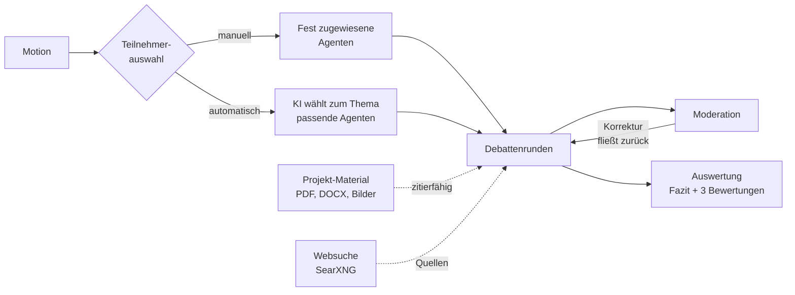
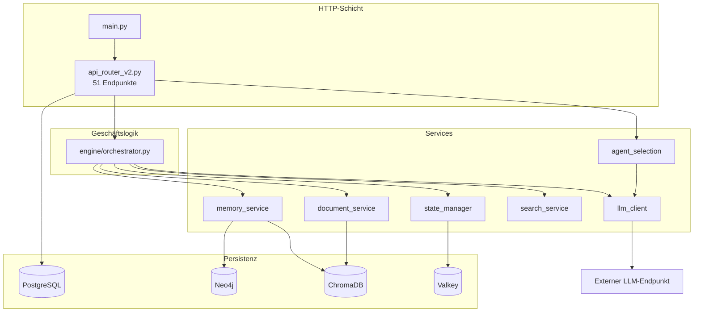
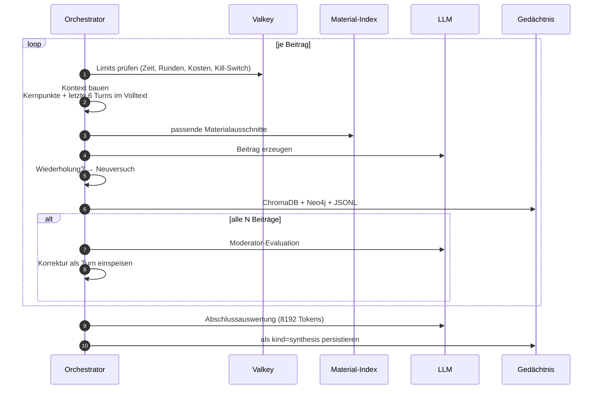

# Abelard

> Multi-Agenten-Debattenplattform mit GraphRAG-Gedächtnis, KI-gestützter Moderation
> und begründeter Abschlussauswertung — vollständig souverän betreibbar.

[](https://www.python.org/)
[](https://fastapi.tiangolo.com/)
[](LICENSE)

---

## Worum es geht

Mehrere LLM-Agenten mit ausgearbeiteten Personas diskutieren eine Fragestellung
über mehrere Runden. Das Besondere ist nicht, *dass* sie debattieren — sondern was
das System dagegen unternimmt, dass die Debatte belanglos wird:

- Ein **Moderator** greift in festen Intervallen ein, und seine Korrekturen fließen
  in den Kontext der Agenten zurück statt nur in den Ausgabestrom
- Eine **Loop-Erkennung** wertet den Diskursgraphen aus und setzt bei Themenverengung
  einen neuen Fokus
- Die **Abschlussauswertung** fasst nicht nur zusammen, sondern bewertet die Debatte:
  Erschöpfungsgrad, Plausibilität des Ergebnisses und Qualität der Quellennutzung,
  jeweils 1–10 mit Begründung



## Funktionen

| | |
|---|---|
| **57 Personas** | 50 Wissenschaftler:innen aus Physik, Quantenphysik, Chemie, Mathematik, Informatik, KI, Astrophysik, Astronomie und Quantencomputing — dazu sieben bekannte fiktive KIs. Jeweils mit Biografie, Werkliste und charakteristischem Argumentationsstil. |
| **Automatische Auswahl** | Die KI stellt anhand der Motion das fachlich passendste Teilnehmerfeld zusammen und achtet gezielt auf gegensätzliche Positionen — ein Feld aus Gleichgesinnten erzeugt keine Debatte. |
| **Projekt-Material** | Dokumente und Bilder hochladen; relevante Ausschnitte werden pro Turn abgerufen und von den Agenten zitiert. |
| **Echte Recherche** | Websuche über SearXNG mit DuckDuckGo-Fallback statt halluzinierter Quellen. |
| **Duales Gedächtnis** | ChromaDB für semantische Ähnlichkeit, Neo4j für den Diskursgraphen. |
| **Mandantentrennung** | Jeder Nutzer sieht nur eigene Daten. Admins können Agenten global freigeben; andere übernehmen sie als eigene Kopie. |
| **Guardrails** | Kosten-, Runden- und Zeitlimit, Kill-Switch je Session und global. |

## Architektur



Die Schichtregel: `main.py` enthält keine Geschäftslogik, `engine/` kennt keine
HTTP-Details, `services/` kennt weder HTTP noch den Debattenablauf.

### Warum drei Datenspeicher

| Speicher | Beantwortet | Wird gebraucht für |
|----------|-------------|--------------------|
| PostgreSQL | Wem gehört was? | Mandantentrennung, Projekte, Agenten |
| ChromaDB | Was ähnelt dem hier? | Passende Materialausschnitte je Turn |
| Neo4j | Wer bezog sich worauf? | Loop-Erkennung über die Konzeptdichte |

Valkey ist kein Gedächtnis, sondern Steuerung: Kill-Switch, Kosten- und
Rundenzähler, isoliert je Session.

## Ablauf einer Debatte



> **Wichtig:** Die Debattenschleife läuft als `asyncio`-Task im App-Prozess.
> Ein Neustart des Containers bricht laufende Debatten ab.

## Schnellstart

```bash
git clone <repo-url> && cd abelard

cp .env.example .env
# Pflichtwerte setzen — je einmal `openssl rand -hex 32`:
#   POSTGRES_PASSWORD, NEO4J_PASSWORD, JWT_SECRET

docker compose up -d --build
curl http://localhost:8106/health
```

Dashboard: `http://localhost:8106/` · OpenAPI: `http://localhost:8106/docs`

Erste Schritte in der Oberfläche: registrieren, unter *LLM-Endpunkte* einen Zugang
hinterlegen und als Standard setzen, dann per Knopf **„🎓 Persona-Bibliothek"** die
57 Personas anlegen, ein Projekt mit Motion erstellen und die Debatte starten.

## Konfiguration

Alles läuft über Umgebungsvariablen (`config.py`, Pydantic Settings).
**Im Quelltext stehen bewusst keine Passwörter oder Schlüssel.** Fehlende
Geheimnisse erzeugen in der Entwicklung Warnungen, bei `ENVIRONMENT=production`
bricht der Start ab.

| Variable | Default | Zweck |
|----------|---------|-------|
| `ENVIRONMENT` | `development` | `production` erzwingt starke Geheimnisse |
| `DEFAULT_PROVIDER` | `openai` | Spricht jede OpenAI-kompatible API |
| `OPENAI_API_KEY` / `OPENAI_MODEL` | – / `gpt-4o-mini` | Rückfallebene für Agenten ohne eigene Wahl |
| `POSTGRES_PASSWORD` | – | **Pflicht** |
| `NEO4J_PASSWORD` | – | **Pflicht** |
| `JWT_SECRET` | – | **Pflicht**, sonst Zufallswert je Start |
| `SEARXNG_BASE_URL` | `http://searxng:8080` | Websuche der Agenten |
| `UPLOAD_DIR` / `DEBATE_LOG_DIR` | `/data/uploads` / `/data/debate-logs` | Dateiablage |
| `COST_THRESHOLD_USD` | `5.0` | Kostenbremse je Debatte |
| `MODERATOR_INTERVAL` | `3` | Beiträge zwischen Moderator-Eingriffen |

Vollständig dokumentiert unter [`docs/konfiguration.md`](docs/konfiguration.md).

Deployment-spezifisches (etwa `extra_hosts`) gehört in
`docker-compose.override.yml` — Vorlage liegt als `.example` daneben, die echte
Datei wird nie veröffentlicht.

## Abhängigkeiten

Python 3.12+. Laufzeit in `requirements.txt`, Werkzeuge in `requirements-dev.txt`.

**Laufzeit:** FastAPI · uvicorn · Jinja2 · python-multipart · SQLAlchemy (async) ·
asyncpg · neo4j · chromadb · redis[hiredis] · httpx · pydantic · pydantic-settings ·
pypdf · python-docx · pillow

**Bewusst nicht dabei:** Das `openai`-SDK — alle Aufrufe laufen direkt über `httpx`
gegen die kompatible HTTP-Schnittstelle, dadurch funktioniert jedes Gateway ohne
SDK-Anpassung. JWT und Passwort-Hashing nutzen `hmac`/`hashlib` aus der
Standardbibliothek statt `python-jose` und `passlib`.

**Externe Dienste** (aus `docker-compose.yml`): PostgreSQL 17 · Neo4j 5 · ChromaDB ·
Valkey · SearXNG. Der LLM-Endpunkt ist *nicht* Teil des Stacks, sondern wird pro
Nutzer im Profil hinterlegt.

Details unter [`docs/abhaengigkeiten.md`](docs/abhaengigkeiten.md).

## Entwicklung

```bash
pip install -r requirements-dev.txt

pytest tests/ -v                                  # 114 Tests
pytest tests/ --cov=. --cov-report=term-missing
ruff check .
mkdocs serve                                      # Doku auf :8000
```

Vor jeder Veröffentlichung:

```bash
bash scripts/run_security_scan.sh       # Secrets, Config, Bandit, Trivy
bash scripts/sync-to-publish.sh --dry-run
```

> `tests/critical-fixes/` läuft in einer eigenen Container-Umgebung und ist lokal
> über `pyproject.toml` ausgeschlossen.

## Dokumentation

```bash
pip install mkdocs mkdocs-material && mkdocs serve
```

| Thema | Datei |
|-------|-------|
| Architektur und Schichten | [`docs/de/architecture/overview.md`](docs/de/architecture/overview.md) |
| Debatten-Lebenszyklus | [`docs/de/architecture/debate-lifecycle.md`](docs/de/architecture/debate-lifecycle.md) |
| Datenmodell (ER, Graph, Vektoren) | [`docs/de/architecture/data-models.md`](docs/de/architecture/data-models.md) |
| Konfiguration | [`docs/de/konfiguration.md`](docs/de/konfiguration.md) |
| Abhängigkeiten | [`docs/de/abhaengigkeiten.md`](docs/de/abhaengigkeiten.md) |
| API-Referenz | [`docs/de/api-reference.md`](docs/de/api-reference.md) |
| Personas und Auswertung | [`docs/de/personas-und-auswertung.md`](docs/de/personas-und-auswertung.md) |
| Automatische Agentenauswahl | [`docs/de/automatische-agentenauswahl.md`](docs/de/automatische-agentenauswahl.md) |
| Globale Agenten | [`docs/de/globale-agenten.md`](docs/de/globale-agenten.md) |
| Projekt-Material | [`docs/de/uploads.md`](docs/de/uploads.md) |
| Veröffentlichung | [`docs/de/veroeffentlichung.md`](docs/de/veroeffentlichung.md) |

## Sicherheitshinweise

- Keine Credential-Defaults im Quelltext; `ENVIRONMENT=production` erzwingt gesetzte,
  nicht-triviale Geheimnisse
- Mandantentrennung auf jeder Abfrage; fremde Objekte liefern 404 statt 403
- JWT-Signatur und Passwort-Hashing sind mit Standardbibliotheks-Primitiven selbst
  implementiert. Das spart Abhängigkeiten, verlagert die Verantwortung aber auf
  dieses Projekt — für sicherheitskritische Installationen prüfenswert.

## Lizenz

[MIT](LICENSE)
