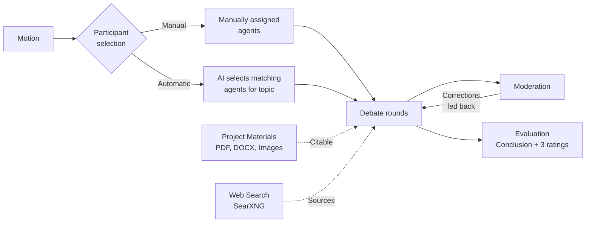
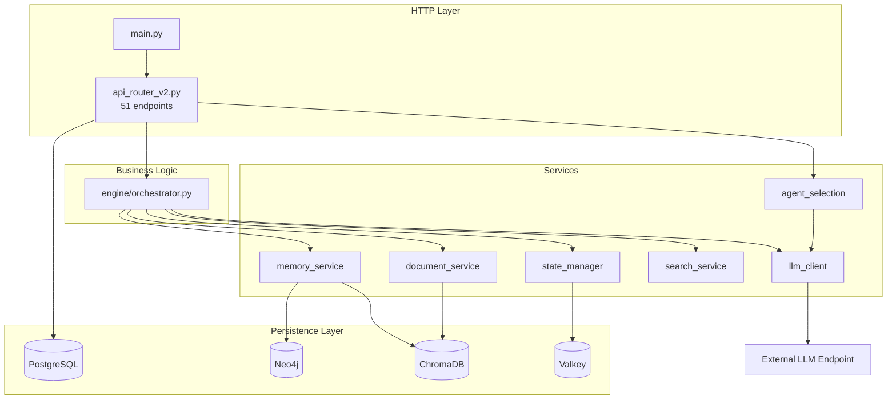
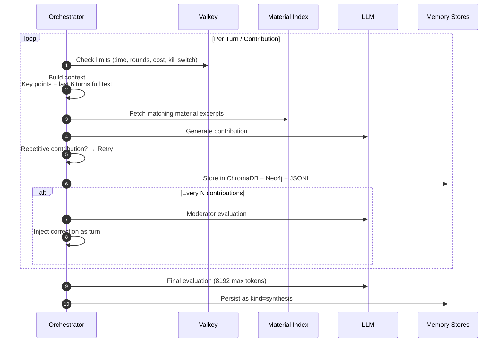

# Abelard

> Multi-agent debate platform featuring GraphRAG memory, AI-powered moderation,
> and reasoned final evaluations — fully self-hostable and sovereign.

[](https://www.python.org/)
[](https://fastapi.tiangolo.com/)
[](LICENSE)
[](README-DE.md)

---

## Overview

Multiple LLM agents with elaborate personas discuss a topic or motion over several rounds. What sets Abelard apart is not just *that* they debate — but how the system prevents debates from becoming superficial or repetitive:

- A **Moderator** intervenes at fixed intervals, feeding corrections back directly into the agents' context rather than just the output stream.
- **Loop Detection** evaluates the discourse graph to detect narrow or repeating topics and sets a new focus when needed.
- The **Final Evaluation** goes beyond summarizing: it assesses the debate on exhaustion degree, result plausibility, and source quality (each rated 1–10 with detailed reasoning).



## Key Features

| Feature | Description |
|---|---|
| **57 Personas** | 50 real historical & contemporary scientists across physics, quantum physics, chemistry, mathematics, computer science, AI, astrophysics, astronomy, and quantum computing — plus seven famous fictional AIs. Each persona comes with a biography, key publications/works, and a distinct argumentation style. |
| **Automated Selection** | The AI curates the most suitable panel of participants based on the motion, deliberately fostering opposing viewpoints — a panel of identical minds yields no real debate. |
| **Project Materials** | Upload documents and images; relevant excerpts are retrieved per turn and cited directly by the agents. |
| **Real Research** | Web search via SearXNG with DuckDuckGo fallback instead of hallucinated references. |
| **Dual Memory System** | ChromaDB for semantic vector similarity, Neo4j for the discourse graph structure. |
| **Multi-Tenancy** | Strict user data isolation. Admins can share agents globally; users can clone them into their own scope. |
| **Guardrails** | Session and global cost, round, and time limits accompanied by a real-time kill switch. |

## Architecture



Strict Layering Rules: `main.py` contains no business logic, `engine/` is unaware of HTTP details, and `services/` contains neither HTTP logic nor debate lifecycle flows.

### Why Three Data Stores?

| Store | Key Question Answered | Primary Use Case |
|-------|----------------------|------------------|
| PostgreSQL | Who owns what? | Multi-tenancy, projects, user agents |
| ChromaDB | What is semantically similar? | Relevant material excerpts per turn |
| Neo4j | Who referenced what? | Loop detection via concept density |

Valkey is not memory, but operational control: kill switch, cost tracking, and round counters, isolated per session.

## Debate Lifecycle



> **Important:** The debate loop runs as an `asyncio` task within the main application process. Restarting the container will terminate ongoing active debates.

## Quickstart

```bash
git clone <repo-url> && cd abelard

cp .env.example .env
# Set required secret values (generate each with `openssl rand -hex 32`):
#   POSTGRES_PASSWORD, NEO4J_PASSWORD, JWT_SECRET

docker compose up -d --build
curl http://localhost:8106/health
```

- **Dashboard**: `http://localhost:8106/`
- **OpenAPI / Swagger Docs**: `http://localhost:8106/docs`

**First Steps in the Web Interface:**
1. Register a new user account.
2. Navigate to **LLM Endpoints**, add your API key/credentials, and set it as default.
3. Click **"🎓 Persona Library"** to seed all 57 personas.
4. Create a new project with a debate motion and launch the debate.

## Configuration

Configuration is managed via environment variables (`config.py`, Pydantic Settings).
**No passwords or API keys are hardcoded in the codebase.** Missing required secrets trigger warnings in development and cause immediate startup termination when `ENVIRONMENT=production`.

| Variable | Default | Description |
|----------|---------|-------------|
| `ENVIRONMENT` | `development` | Setting to `production` enforces strong secrets |
| `DEFAULT_PROVIDER` | `openai` | Supports any OpenAI-compatible API endpoint |
| `OPENAI_API_KEY` / `OPENAI_MODEL` | – / `gpt-4o-mini` | Fallback model for agents without custom choice |
| `POSTGRES_PASSWORD` | – | **Required** |
| `NEO4J_PASSWORD` | – | **Required** |
| `JWT_SECRET` | – | **Required** (random per start if omitted) |
| `SEARXNG_BASE_URL` | `http://searxng:8080` | Web search backend for agents |
| `UPLOAD_DIR` / `DEBATE_LOG_DIR` | `/data/uploads` / `/data/debate-logs` | Storage paths for files and logs |
| `COST_THRESHOLD_USD` | `5.0` | Cost guardrail per debate session |
| `MODERATOR_INTERVAL` | `3` | Number of turns between moderator interventions |

Full documentation available at [`docs/konfiguration.md`](docs/konfiguration.md).

Deployment-specific overrides (such as `extra_hosts`) belong in `docker-compose.override.yml`. A template is provided in `docker-compose.override.yml.example`; the active file is excluded from version control.

## Dependencies

- **Python 3.12+**
- Runtime requirements: `requirements.txt`
- Development tools: `requirements-dev.txt`

**Runtime Stack:** FastAPI, uvicorn, Jinja2, python-multipart, SQLAlchemy (async), asyncpg, neo4j, chromadb, redis[hiredis], httpx, pydantic, pydantic-settings, pypdf, python-docx, pillow.

**Deliberate Omissions:**
- **No `openai` SDK:** All API calls are executed directly via `httpx` against OpenAI-compatible HTTP endpoints. This ensures support for custom LLM gateways without SDK dependency constraints.
- **No `python-jose` / `passlib`:** JWT signing and password hashing utilize standard library primitives (`hmac`, `hashlib`).

**External Services** (defined in `docker-compose.yml`): PostgreSQL 17, Neo4j 5, ChromaDB, Valkey, SearXNG. The LLM endpoint is *not* packaged in the stack; users specify their own in their account settings.

See [`docs/abhaengigkeiten.md`](docs/abhaengigkeiten.md) for further details.

## Development

```bash
pip install -r requirements-dev.txt

pytest tests/ -v                                  # Runs unit & integration test suite
pytest tests/ --cov=. --cov-report=term-missing
ruff check .
mkdocs serve                                      # Runs documentation server on :8000
```

Before committing/publishing changes:

```bash
bash scripts/run_security_scan.sh       # Secret scanning, config audit, Bandit, Trivy
bash scripts/sync-to-publish.sh --dry-run
```

> Note: `tests/critical-fixes/` runs in an isolated container environment and is excluded locally via `pyproject.toml`.

## Documentation

```bash
pip install mkdocs mkdocs-material && mkdocs serve
```

| Topic | File |
|-------|------|
| Architecture & Layering | [`docs/en/architecture/overview.md`](docs/en/architecture/overview.md) |
| Debate Lifecycle | [`docs/en/architecture/debate-lifecycle.md`](docs/en/architecture/debate-lifecycle.md) |
| Data Models (ER, Graph, Vectors) | [`docs/en/architecture/data-models.md`](docs/en/architecture/data-models.md) |
| Configuration | [`docs/en/configuration.md`](docs/en/configuration.md) |
| Dependencies | [`docs/en/dependencies.md`](docs/en/dependencies.md) |
| API Reference | [`docs/en/api-reference.md`](docs/en/api-reference.md) |
| Personas & Evaluation | [`docs/en/personas-and-evaluation.md`](docs/en/personas-and-evaluation.md) |
| Automatic Agent Selection | [`docs/en/automatic-agent-selection.md`](docs/en/automatic-agent-selection.md) |
| Global Agents | [`docs/en/global-agents.md`](docs/en/global-agents.md) |
| Project Materials / Uploads | [`docs/en/uploads.md`](docs/en/uploads.md) |
| Publishing & Release | [`docs/en/publishing.md`](docs/en/publishing.md) |

## Security Considerations

- No credential defaults in source code; `ENVIRONMENT=production` enforces non-trivial secrets.
- Strict multi-tenancy enforcement on every database query; requests for non-owned objects return `404 Not Found` rather than `403 Forbidden` to prevent object enumeration.
- JWT signing and password hashing are implemented with standard library primitives to minimize third-party supply chain risks.

## License

[MIT](LICENSE)
