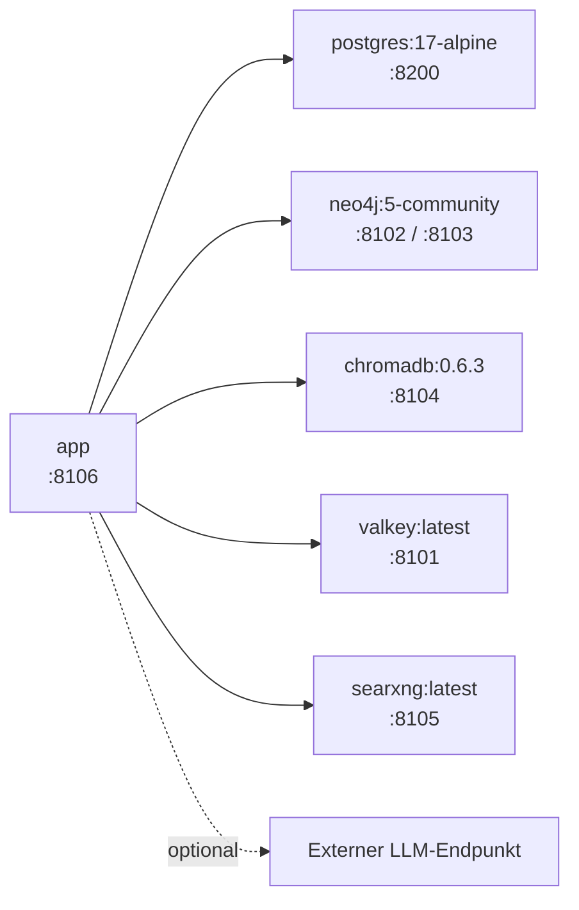

# Abhängigkeiten

Python 3.12 oder neuer. Zwei Dateien, die konsistent gehalten werden:
`requirements.txt` (Laufzeit) und `requirements-dev.txt` (zusätzlich Test- und
Prüfwerkzeuge). `pyproject.toml` spiegelt beides für Poetry.

```bash
pip install -r requirements.txt        # Betrieb
pip install -r requirements-dev.txt    # Entwicklung
poetry install                         # Alternative
```

## Laufzeit

### Web und Server

| Paket | Version | Wofür |
|-------|---------|-------|
| `fastapi` | 0.115.6 | REST- und WebSocket-Endpunkte, Pydantic-Validierung |
| `uvicorn[standard]` | 0.34.0 | ASGI-Server |
| `jinja2` | 3.1.5 | Rendert das Dashboard-Template |
| `python-multipart` | 0.0.20 | Verarbeitet `multipart/form-data` beim Datei-Upload |

!!! warning "FastAPI-Version ist gepinnt"
    Mit FastAPI 0.141 und Starlette 1.3 registriert `include_router()` die Routen
    nicht mehr — die Anwendung startet, liefert aber ausschließlich 404. Die
    Pinnung auf 0.115.6 ist deshalb kein Zufall.

### Datenbank

| Paket | Version | Wofür |
|-------|---------|-------|
| `sqlalchemy[asyncio]` | 2.0.36 | ORM mit asynchroner Session |
| `asyncpg` | 0.30.0 | PostgreSQL-Treiber für den async-Pfad |

### Gedächtnis

| Paket | Version | Wofür |
|-------|---------|-------|
| `neo4j` | 5.27.0 | Diskursgraph, asynchroner Treiber |
| `chromadb` | 0.6.3 | Vektorindex für Beiträge und Material |
| `redis[hiredis]` | 5.2.1 | Valkey-Client — `redis.asyncio`, **nie** der synchrone Import |

### HTTP

| Paket | Version | Wofür |
|-------|---------|-------|
| `httpx` | 0.28.1 | Alle LLM-Aufrufe, Websuche, Endpunkt-Tests |

Das offizielle `openai`-SDK wird **nicht** verwendet. Die Engine spricht die
OpenAI-kompatible HTTP-Schnittstelle direkt an — dadurch funktioniert jedes
Gateway ohne SDK-Anpassung, und eine Abhängigkeit weniger muss gepflegt werden.

### Konfiguration

| Paket | Version | Wofür |
|-------|---------|-------|
| `pydantic` | 2.10.4 | Datenmodelle und Validierung |
| `pydantic-settings` | 2.7.1 | Einlesen der `.env` |
| `python-dotenv` | 1.0.1 | `.env`-Unterstützung |

### Datei-Upload

| Paket | Version | Wofür |
|-------|---------|-------|
| `pypdf` | 6.10.2 | Text aus PDF |
| `python-docx` | 1.2.0 | Absätze und Tabellen aus DOCX |
| `pillow` | 12.2.0 | Bildmetadaten (Format, Abmessungen) |

## Entwicklung

| Paket | Wofür |
|-------|-------|
| `pytest`, `pytest-asyncio`, `pytest-cov` | Testsuite (114 Tests) |
| `ruff` | Linting und Import-Sortierung |
| `mypy` | Typprüfung |
| `bandit` | Statische Sicherheitsanalyse, genutzt von `scripts/run_security_scan.sh` |
| `mkdocs`, `mkdocs-material` | Diese Dokumentation samt Mermaid-Darstellung |

## Bewusst nicht verwendet

| Paket | Warum nicht |
|-------|-------------|
| `openai` | Aufrufe laufen direkt über `httpx` gegen die kompatible API |
| `python-jose` | JWT wird mit `hmac` und `hashlib` aus der Standardbibliothek signiert |
| `passlib` / `bcrypt` | Passwort-Hashing ebenfalls über `hashlib` |
| `alembic` | Schema-Änderungen laufen additiv über `create_all` und `ALTER TABLE … IF NOT EXISTS` |
| `psycopg2-binary` | Der async-Pfad nutzt ausschließlich `asyncpg` |
| `loguru` | Es genügt das `logging`-Modul der Standardbibliothek |

Diese Pakete standen früher in `pyproject.toml`, wurden aber nie importiert.

!!! danger "Eigenbau-Kryptografie"
    JWT-Signatur und Passwort-Hashing sind in `services/user_service.py` mit
    Standardbibliotheks-Primitiven selbst implementiert. Das vermeidet
    Abhängigkeiten, verlagert die Verantwortung aber auf dieses Projekt. Wer die
    Engine in einer sicherheitskritischen Umgebung betreibt, sollte diesen Teil
    prüfen und einen Wechsel auf `pyjwt` und `argon2-cffi` erwägen.

## Externe Dienste

Kommen aus `docker-compose.yml`, nicht aus pip:



| Dienst | Image | Hostport |
|--------|-------|----------|
| PostgreSQL | `postgres:17-alpine` | 8200 |
| Neo4j | `neo4j:5-community` (mit APOC) | 8102 (HTTP), 8103 (Bolt) |
| ChromaDB | `chromadb/chroma:0.6.3` | 8104 |
| Valkey | `valkey/valkey:latest` | 8101 |
| SearXNG | `searxng/searxng:latest` | 8105 |
| Anwendung | lokaler Build | 8106 |

Alle Dienste haben Healthchecks; die Anwendung startet erst, wenn alle gesund sind.

Der LLM-Endpunkt ist **nicht** Teil des Stacks — er wird pro Nutzer im Profil
hinterlegt. Damit läuft die Engine gegen lokale Modelle ebenso wie gegen jede
OpenAI-kompatible Schnittstelle.

## Sicherheitsprüfung der Abhängigkeiten

```bash
bash scripts/run_security_scan.sh                          # inkl. Trivy
SEVERITY=MEDIUM,HIGH,CRITICAL bash scripts/run_security_scan.sh
SKIP_TRIVY=1 bash scripts/run_security_scan.sh             # ohne Docker
```
