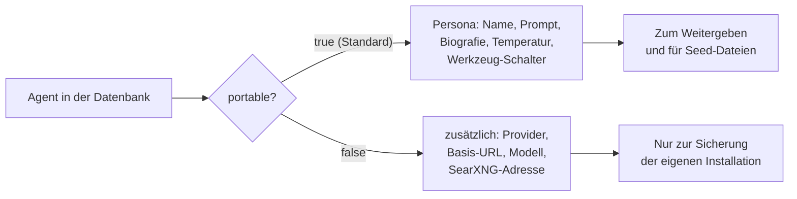
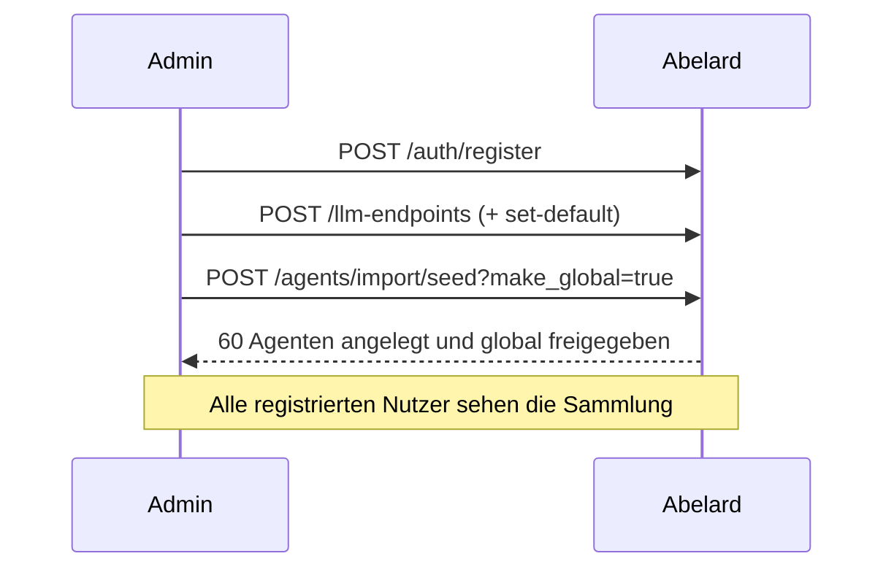

# Agenten importieren und exportieren

Agenten lassen sich als versioniertes JSON sichern, weitergeben und auf einer
neuen Installation einspielen. Für die Erstinbetriebnahme liegt eine fertige
Sammlung unter `seeds/agents.json` bei.

## Zwei Exportformen



**Portabel** enthält nur, was die Persona ausmacht. Modell und Basis-URL bleiben
weg, weil sie auf einer anderen Installation nicht existieren — und weil interne
Adressen sonst nach außen gelangen könnten. Importierte Agenten erben stattdessen
den Standard-Endpunkt des importierenden Nutzers.

**Vollständig** nimmt die LLM-Zuordnung mit. Sinnvoll als Sicherung derselben
Installation, nicht zum Teilen.

!!! note "API-Schlüssel sind nie enthalten"
    Sie hängen am `UserLLMEndpoint`, nicht am Agenten — in keiner der beiden Formen
    kann ein Schlüssel mit exportiert werden.

Automatisch erzeugte Projekt-Arbeitskopien (`skills_json.auto_assigned`) werden
übersprungen; sie sind Ableitungen, keine eigenständigen Personas. Gleiche Namen
werden zusammengefasst.

## Endpunkte

```
GET  /api/v2/agents/export?scope=own|global|all&portable=true|false
POST /api/v2/agents/import?on_conflict=skip|rename|replace&make_global=false
POST /api/v2/agents/import/seed?on_conflict=skip&make_global=false
```

### Konfliktstrategie

| `on_conflict` | Verhalten bei gleichem Namen |
|---------------|------------------------------|
| `skip` (Standard) | Vorhandener Agent bleibt unberührt |
| `rename` | Import wird als „Name (2)" angelegt |
| `replace` | Vorhandener Agent wird gelöscht und ersetzt |

`make_global=true` ist Admins vorbehalten und liefert sonst **403**.

### Beispiele

```bash
# Sichern
curl -s "http://localhost:8106/api/v2/agents/export?scope=own&portable=false" \
  -H "Authorization: Bearer $TOKEN" -o meine-agenten.json

# Einspielen
curl -X POST "http://localhost:8106/api/v2/agents/import?on_conflict=rename" \
  -H "Authorization: Bearer $TOKEN" -H "Content-Type: application/json" \
  -d @meine-agenten.json

# Mitgelieferte Sammlung auf einer frischen Instanz
curl -X POST "http://localhost:8106/api/v2/agents/import/seed?make_global=true" \
  -H "Authorization: Bearer $ADMIN_TOKEN"
```

## Dateiformat

```json
{
  "schema_version": 1,
  "portable": true,
  "source": "abelard/seed",
  "count": 60,
  "agents": [
    {
      "name": "Ada Lovelace",
      "system_prompt": "Du verkörperst Ada Lovelace …",
      "persona_bio": "Ada Lovelace (1815–1852) — Informatik …",
      "temperature": 0.7,
      "web_search_enabled": true,
      "web_search_provider": "searxng",
      "knowledge_graph_enabled": true,
      "cache_enabled": true,
      "mcp_enabled": true
    }
  ]
}
```

Der Import akzeptiert auch eine blanke Liste von Agenten ohne Rahmenobjekt.
Unbekannte Felder werden verworfen, überlange Texte gekappt, `temperature` auf
0–2 begrenzt und ein unbekannter Suchanbieter auf `duckduckgo` zurückgesetzt.
Maximal 500 Agenten je Import.

## Mitgelieferte Sammlung

`seeds/agents.json` enthält 60 Personas: die 50 Wissenschaftler:innen und sieben
fiktiven KIs aus der Bibliothek sowie Sokrates, Immanuel Kant und Johann Wolfgang
von Goethe.

Die Datei ist bewusst **deterministisch**: alphabetisch sortiert und ohne
Zeitstempel. Ein erneuter Export erzeugt daher nur dann einen Diff, wenn sich
inhaltlich etwas geändert hat.

### Neu erzeugen

```bash
TOKEN=...   # Admin-Token
curl -s "http://localhost:8106/api/v2/agents/export?scope=own&portable=true" \
  -H "Authorization: Bearer $TOKEN" \
  | python3 -c "
import json,sys
b = json.load(sys.stdin)
seed = {'schema_version': b['schema_version'], 'portable': True, 'source': 'abelard/seed',
        'description': 'Mitgelieferte Persona-Sammlung.',
        'count': b['count'], 'agents': sorted(b['agents'], key=lambda a: a['name'])}
print(json.dumps(seed, ensure_ascii=False, indent=2))
" > seeds/agents.json
```

Die Testsuite prüft anschließend automatisch, dass die Datei portabel und frei von
internen Adressen ist (`tests/test_agent_transfer.py::TestSeedFile`).

## Erstinbetriebnahme



Im Dashboard geht das über die Agentenseite, Knopf **„⇅ Import / Export"** und
dort **„📦 Mitgelieferte Sammlung"**.

Alternativ legt `POST /agents/seed-personas` dieselben Personas aus dem Quelltext
(`services/persona_library.py`) an. Der Unterschied: Die Seed-Datei enthält
zusätzlich die drei Philosophen und lässt sich ohne Codeänderung pflegen.
