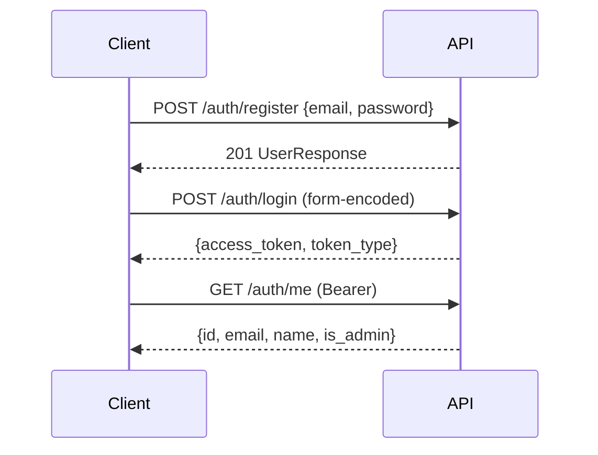

# API-Referenz

Alle Endpunkte liegen unter `/api/v2`. Bis auf Registrierung und Login erfordern
sie ein JWT im Header `Authorization: Bearer <token>` — alternativ als
Query-Parameter `?token=…` (nötig für WebSocket-Verbindungen und Datei-Downloads).

Jede Abfrage filtert nach `user_id`. Fremde Objekte liefern **404**, nicht 403 —
damit lässt sich nicht ermitteln, ob eine ID existiert.

## Authentifizierung



| Methode | Pfad | Zweck |
|---------|------|-------|
| POST | `/auth/register` | Registrierung (Passwort mind. 8 Zeichen) |
| POST | `/auth/login` | Login, liefert JWT (OAuth2-Formular) |
| GET | `/auth/me` | Aktueller Nutzer inklusive `is_admin` |

## LLM-Endpunkte (Profil)

Pro Nutzer gespeicherte Zugänge. Der Endpunkt mit `is_default` ist das
„Profil-LLM" und wird für die automatische Agentenauswahl verwendet.

| Methode | Pfad | Zweck |
|---------|------|-------|
| POST | `/llm-endpoints` | Endpunkt anlegen |
| GET | `/llm-endpoints` | Eigene Endpunkte auflisten |
| GET | `/llm-endpoints/{id}` | Einzelnen abrufen |
| PATCH | `/llm-endpoints/{id}` | Ändern |
| DELETE | `/llm-endpoints/{id}` | Löschen |
| POST | `/llm-endpoints/{id}/set-default` | Als Profil-LLM setzen |
| POST | `/llm-endpoints/test` | Verbindung ungespeicherter Daten testen |
| POST | `/llm-endpoints/{id}/test` | Gespeicherten Endpunkt testen |
| GET | `/llm-endpoints/models` | Modelle des Standardendpunkts |
| GET | `/llm-endpoints/{id}/models` | Modelle eines bestimmten Endpunkts |

## Agenten

| Methode | Pfad | Zweck |
|---------|------|-------|
| POST | `/agents` | Agent anlegen |
| GET | `/agents?scope=all\|own\|global` | Auflisten; `all` = eigene plus global |
| GET | `/agents/{id}` | Eigenen oder global freigegebenen abrufen |
| PUT | `/agents/{id}` | Ändern (nur Eigentümer) |
| DELETE | `/agents/{id}` | Löschen (nur Eigentümer) |
| PATCH | `/agents/{id}/global` | Global freigeben — **nur Admins** |
| POST | `/agents/{id}/clone` | Globalen Agenten als eigene Kopie übernehmen |
| POST | `/agents/seed-personas?make_global=true` | Persona-Bibliothek anlegen (57 Stück, idempotent) |

Jeder Agent trägt in der Antwort `is_global` und `is_owner`, damit Oberflächen
Aktionen korrekt einschränken können.

## Projekte

| Methode | Pfad | Zweck |
|---------|------|-------|
| POST | `/projects` | Projekt mit Motion und Moderator-Konfiguration anlegen |
| GET | `/projects` | Eigene Projekte |
| GET | `/projects/{id}` | Einzelnes Projekt |
| PATCH | `/projects/{id}` | Ändern |
| DELETE | `/projects/{id}` | Löschen (kaskadiert auf Agenten, Sessions, Material) |
| POST | `/projects/{id}/suggest-agents` | Teilnehmer per KI vorschlagen |

`suggest-agents` kennt zwei Parameter: `?apply=true` legt die Auswahl als
Projekt-Agenten an, `?count=N` übersteuert die Teilnehmerzahl. Ohne `apply` ist der
Aufruf frei von Nebenwirkungen.

Relevante Felder beim Anlegen:

```json
{
  "name": "Ethik autonomer Systeme",
  "motion": "Sollten vollautonome Waffensysteme verboten werden?",
  "agent_selection_mode": "auto",
  "auto_agent_count": 4,
  "moderator_goal": "Ethische und völkerrechtliche Argumente abwägen.",
  "moderator_interval": 4,
  "max_rounds": 3,
  "max_duration_minutes": 40
}
```

## Projekt-Material

| Methode | Pfad | Zweck |
|---------|------|-------|
| POST | `/projects/{id}/documents` | Upload (multipart: `file`, `description`) |
| GET | `/projects/{id}/documents` | Material auflisten |
| GET | `/projects/{id}/documents/{doc_id}/download` | Originaldatei |
| DELETE | `/projects/{id}/documents/{doc_id}` | Löschen inklusive Index-Chunks |

Erlaubt: `.txt`, `.md`, `.pdf`, `.docx`, `.png`, `.jpg`, `.jpeg`, `.webp`, `.gif`.
Bei Bildern wird die **Beschreibung** indexiert — ohne sie ist ein Bild in der
Debatte nicht auffindbar.

```bash
curl -X POST "http://localhost:8106/api/v2/projects/$PID/documents" \
  -H "Authorization: Bearer $TOKEN" \
  -F "file=@studie.pdf" \
  -F "description=Meta-Studie, Kapitel 3 relevant"
```

## Debatten

| Methode | Pfad | Zweck |
|---------|------|-------|
| POST | `/debates` | Session anlegen |
| GET | `/debates` | Eigene Sessions |
| GET | `/debates/{id}` | Status abrufen |
| POST | `/debates/{id}/start` | Starten (im Auto-Modus erfolgt hier die Auswahl) |
| POST | `/debates/{id}/stop` | Kill-Switch setzen und Task abbrechen |
| DELETE | `/debates/{id}` | Löschen |
| GET | `/debates/{id}/turns` | Alle Ereignisse (`turn`, `moderator`, `synthesis`) |
| GET | `/debates/{id}/evaluation` | Abschlussauswertung |
| POST | `/debates/{id}/evaluate` | Auswertung neu erzeugen |
| GET | `/debates/{id}/export` | Verlauf exportieren |
| WS | `/debates/{id}/stream` | Live-Stream |

`POST /evaluate` hilft, wenn eine Debatte abgebrochen wurde oder die Auswertung
fehlt: Sie wird aus den gespeicherten Beiträgen neu berechnet und persistiert.

### Live-Stream

```javascript
const ws = new WebSocket(`ws://localhost:8106/api/v2/debates/${id}/stream?token=${jwt}`);
ws.onmessage = (e) => {
  const { type, data } = JSON.parse(e.data);   // type: "turn"
  console.log(data);   // "[CHARLES BENNETT]: …"
};
```

Beim Verbinden sendet der Server zunächst den bisherigen Verlauf aus der
JSONL-Datei, danach neue Ereignisse in Echtzeit.

## Werkzeuge und Wissen

| Methode | Pfad | Zweck |
|---------|------|-------|
| POST | `/tools/web-search` | Websuche direkt auslösen |
| POST | `/knowledge` | Key-Value-Eintrag anlegen |
| GET | `/knowledge` | Einträge auflisten |
| PATCH | `/knowledge/{id}` | Ändern |
| DELETE | `/knowledge/{id}` | Löschen |

## Systemendpunkte

| Methode | Pfad | Zweck |
|---------|------|-------|
| GET | `/health` | Healthcheck (ohne Präfix, ohne Auth) |
| GET | `/` | Dashboard |
| GET | `/docs` | Interaktive OpenAPI-Oberfläche |

## Fehlercodes

| Code | Bedeutung |
|------|-----------|
| 400 | Ungültige ID oder fachlich unmögliche Anfrage |
| 401 | Token fehlt, abgelaufen oder ungültig |
| 403 | Aktion Admins vorbehalten |
| 404 | Nicht vorhanden **oder** nicht im eigenen Mandanten |
| 409 | Namenskonflikt beim Klonen |
| 410 | Datei laut Datenbank vorhanden, auf der Platte aber weg |
| 422 | Validierung fehlgeschlagen (Dateityp, Größe) |
| 502 | Nachgelagerter Dienst gescheitert (LLM, Auswertung) |
