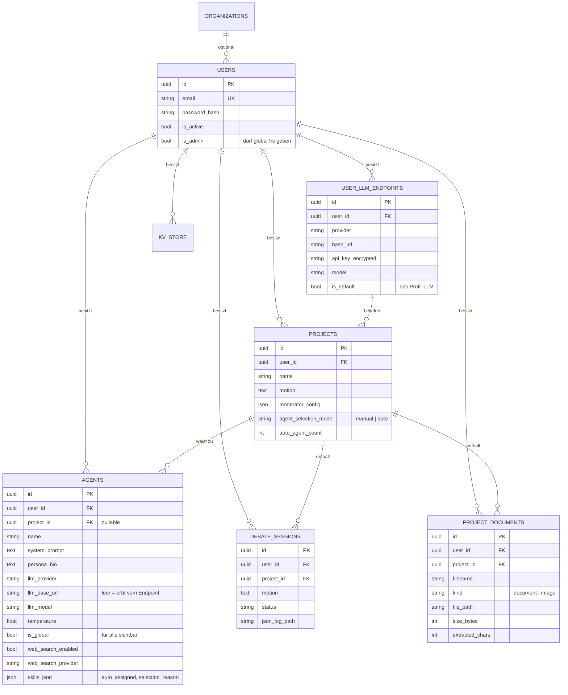
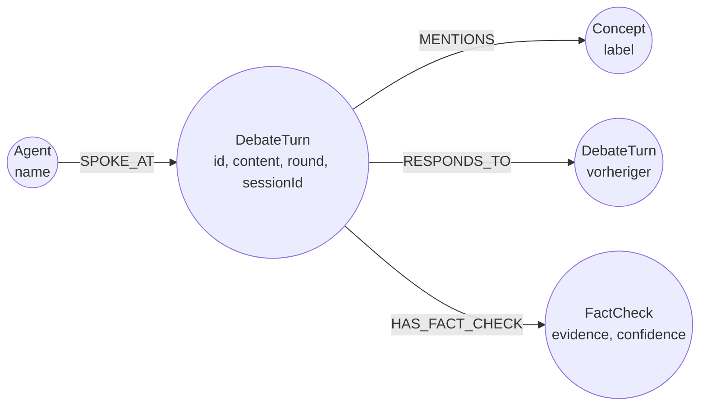

# Datenmodell

## Relationales Modell (PostgreSQL)



### Mandantentrennung

Jede Tabelle außer `organizations` trägt eine **verpflichtende** `user_id`. Alle
Abfragen filtern danach. Einzige Ausnahme: Agenten mit `is_global = true` sind für
alle Nutzer **sichtbar**, bleiben aber im Besitz ihres Eigentümers und können von
anderen weder bearbeitet noch gelöscht werden.

!!! warning "project_id ist ein einzelnes Feld"
    Ein Agent gehört zu höchstens einem Projekt. Würde ein fremder Nutzer einen
    globalen Agenten direkt zuweisen, zöge das den Agenten aus dem Konto des
    Eigentümers. Deshalb klont `_assign_agents_to_project()` fremde globale Agenten,
    statt sie zu verschieben.

### Schema-Migration

Es gibt kein Alembic. `DBManager.initialize()` legt fehlende Tabellen per
`create_all` an und ergänzt neue Spalten idempotent:

```sql
ALTER TABLE agents   ADD COLUMN IF NOT EXISTS is_global BOOLEAN DEFAULT FALSE;
ALTER TABLE users    ADD COLUMN IF NOT EXISTS is_admin  BOOLEAN DEFAULT FALSE;
ALTER TABLE projects ADD COLUMN IF NOT EXISTS agent_selection_mode VARCHAR(16) DEFAULT 'manual';
```

Das genügt für additive Änderungen. Umbenennungen oder Typänderungen erfordern
Handarbeit — für eine größere Installation wäre Alembic der nächste Schritt.

## Diskursgraph (Neo4j)



Jeder `DebateTurn` trägt `sessionId` — ohne diese Eigenschaft würden Abfragen die
Beiträge **aller jemals gelaufenen Debatten** mitzählen und die Loop-Erkennung
unbrauchbar machen.

**Konzept-Extraktion:** Kapitalisierte Wörter ab fünf Zeichen ohne Stoppwörter,
maximal 20 pro Beitrag. Das nutzt aus, dass deutsche Substantive großgeschrieben
werden. Eine frühere Variante prüfte auf `isupper()` — also durchgehende
Großschreibung — und fand in normaler Prosa praktisch nie etwas.

## Vektorindex (ChromaDB)

Zwei Collections mit unterschiedlichem Zweck:

| Collection | Inhalt | Metadaten | Gefiltert nach |
|------------|--------|-----------|----------------|
| `debate_turns` | Redebeiträge | `session_id`, `agent_name`, `round_num` | `session_id` |
| `project_documents` | Material-Chunks | `project_id`, `doc_id`, `filename`, `kind` | `project_id` |

Dokumente werden in ~1200-Zeichen-Blöcke mit 200 Zeichen Überlappung zerlegt,
geschnitten an Absatz- oder Satzgrenzen.

## Laufzeitzustand (Valkey)

Alle Schlüssel sind pro Session isoliert:

| Schlüssel | Zweck |
|-----------|-------|
| `debate:{session_id}:status:active` | Kill-Switch der Session |
| `debate:{session_id}:cost:central` | Kostensumme in USD |
| `debate:{session_id}:tokens:central` | Tokensumme |
| `debate:{session_id}:counter:turn` | Turn-Zähler für das Moderationsintervall |
| `debate:killswitch:global` | Notaus für **alle** Sessions |

Ohne diese Isolation setzte eine zweite Debatte beim Start die Zähler der ersten
zurück, und ein Stopp beendete alle gleichzeitig.

## Dateiablage

```
{UPLOAD_DIR}/{project_id}/{doc_id}_{dateiname}    Hochgeladenes Material
{DEBATE_LOG_DIR}/{session_id}/turns.jsonl         Turns, Moderation, Auswertung
```

Beide Pfade sind konfigurierbar; fehlt Schreibrecht, weicht die Engine auf
`./data/` unterhalb des Arbeitsverzeichnisses aus.
