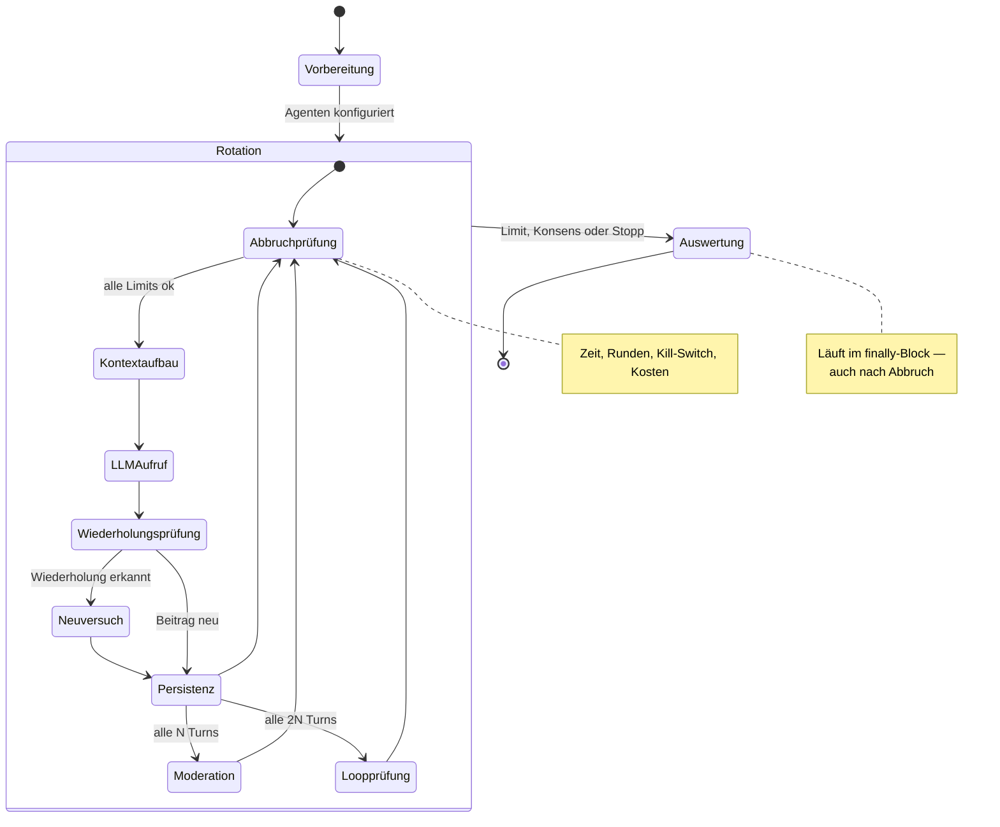
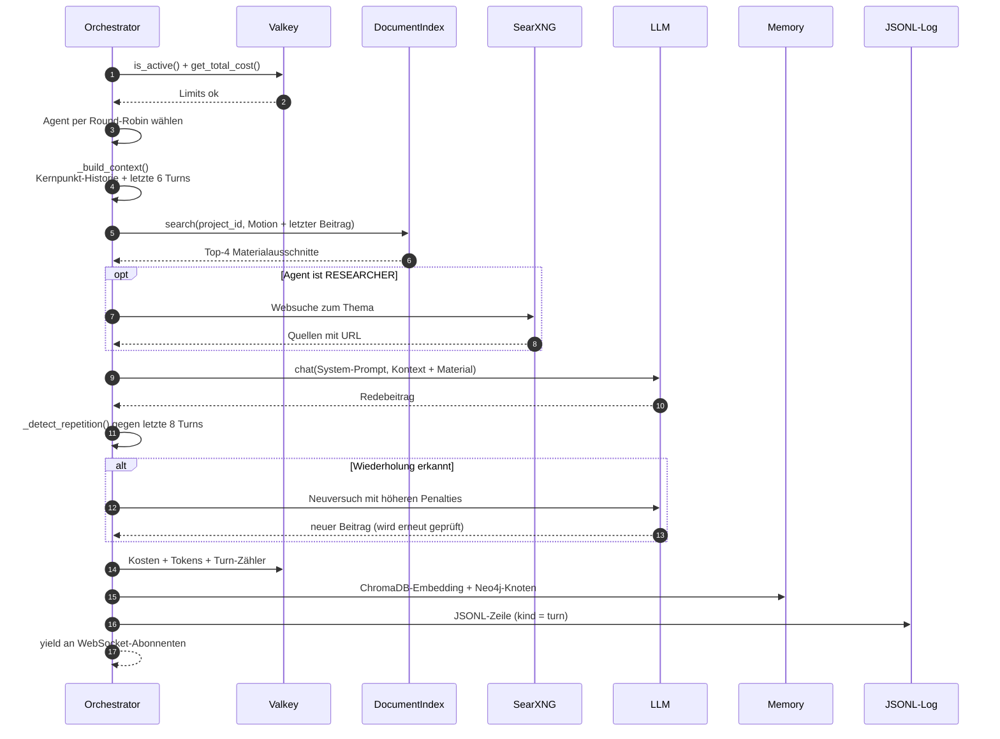
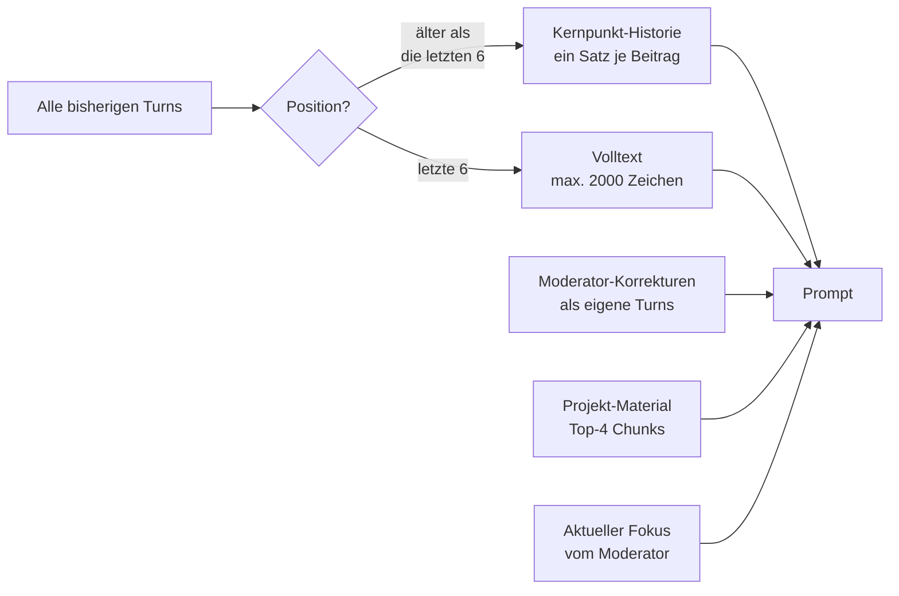
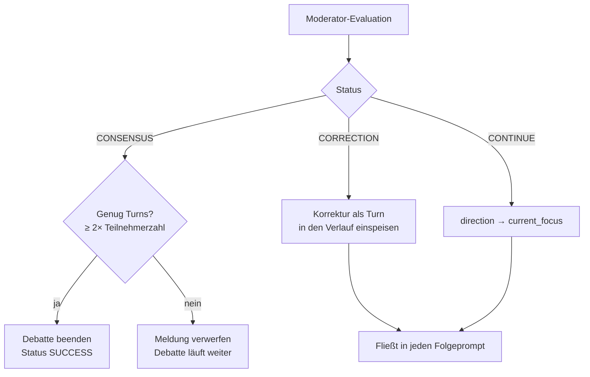
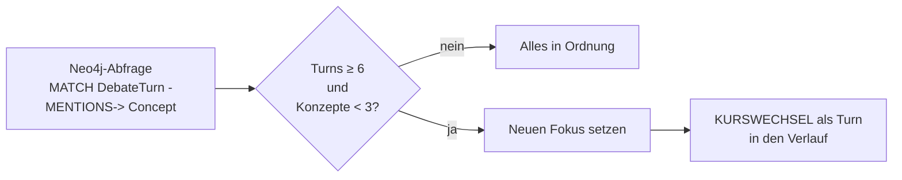
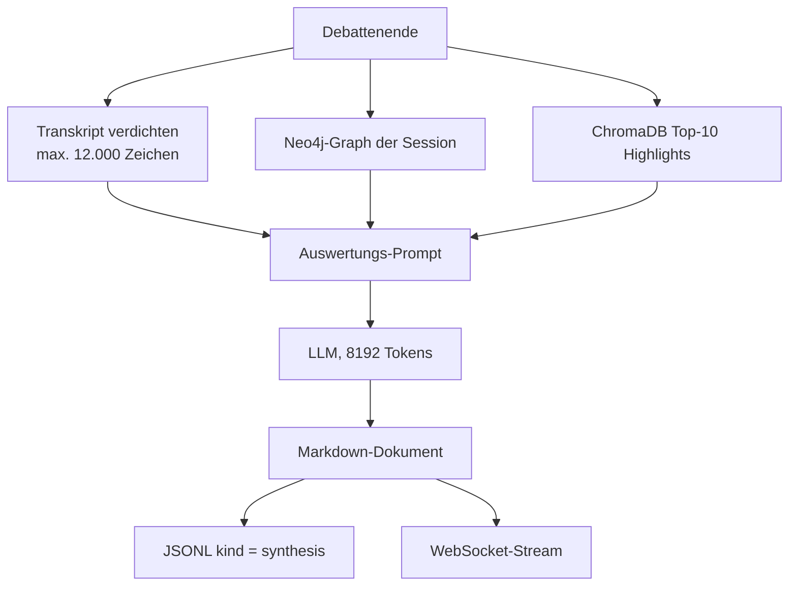

# Debatten-Lebenszyklus

Eine Debatte durchläuft drei Phasen: Vorbereitung, Rotation und Auswertung. Der
gesamte Ablauf liegt in `engine/orchestrator.py::run_debate()`.

## Gesamtablauf

## Ein einzelner Turn im Detail

## Kontextaufbau — der Kern gegen das Kreisdrehen

Frühere Versionen gaben den Agenten nur die letzten zwei Beiträge. Bei mehr als
zwei Teilnehmern sah ein Agent damit nicht einmal seine eigene letzte Aussage —
und wiederholte sich zwangsläufig.

Entscheidend ist, dass **Moderator-Korrekturen als eigene Turns** in `state.turns`
landen. Vorher wurden sie nur an den WebSocket gestreamt und erreichten keinen
einzigen Agenten — die Moderation war wirkungslos.

## Moderation

Der Moderator läuft alle `interval_turns` Beiträge und sieht die **gesamte** Debatte
(ältere Beiträge verdichtet, die letzten drei im Volltext).

Die Konsens-Sperre verhindert, dass ein einzelner versöhnlicher Beitrag die Debatte
vorzeitig beendet.

## Loop-Erkennung

Alle `2 × interval_turns` Beiträge fragt der Orchestrator den Diskursgraphen ab:
Wie viele **verschiedene** Konzepte wurden in dieser Session genannt?

Die Mindestanzahl von sechs Turns ist wichtig: Ohne sie würde die Prüfung bei jeder
jungen Debatte anschlagen, weil noch kaum Konzepte erfasst sind.

## Abbruchbedingungen

| Bedingung | Prüfung | Ergebnis |
|-----------|---------|----------|
| Zeitlimit | `max_duration_minutes` | `TERMINATED` |
| Rundenlimit | `max_rounds` (eine Runde = jeder Agent einmal) | `TERMINATED` |
| Kill-Switch | Valkey `debate:{id}:status:active` | `TERMINATED` |
| Kostenbremse | Valkey-Summe ≥ `COST_THRESHOLD_USD` | `TERMINATED` |
| Konsens | Moderator meldet `CONSENSUS` | `SUCCESS` |

In **allen** Fällen läuft anschließend die Auswertung — sie steht im `finally`-Block.

## Auswertung

Das Ergebnis enthält Zusammenfassung, Kernargumente, Fazit, drei Bewertungen
(Erschöpfungsgrad, Plausibilität, Quellennutzung — je 1–10 mit Begründung) und
offene Fragen. Details unter [Personas & Auswertung](../personas-und-auswertung.md).

## Persistenz der Ereignisse

Alle Ereignisse landen in `{DEBATE_LOG_DIR}/{session_id}/turns.jsonl`:

| `kind` | Inhalt |
|--------|--------|
| `turn` | Redebeitrag eines Agenten |
| `moderator` | Evaluation, Korrektur oder Kurswechsel |
| `synthesis` | Abschlussauswertung |

!!! danger "Früher gingen Moderation und Auswertung verloren"
    Bis zum Fix wurden nur `turn`-Einträge geschrieben. Die Auswertung ging
    ausschließlich an verbundene WebSockets und wurde im Log auf 120 Zeichen gekürzt.
    War niemand verbunden, war das Ergebnis unwiederbringlich weg.
    `POST /debates/{id}/evaluate` erzeugt eine fehlende Auswertung aus den
    gespeicherten Beiträgen neu.
