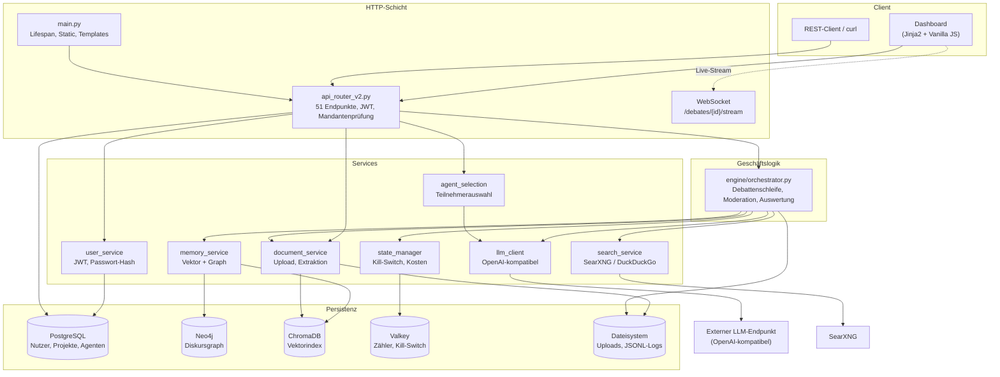
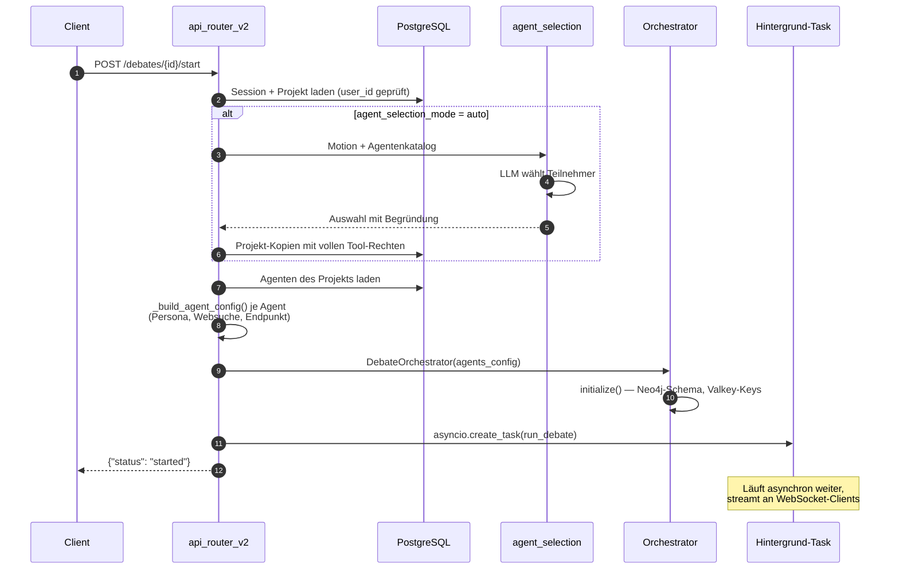

# Architektur-Überblick

Die Engine ist in vier Schichten aufgeteilt. Die Regel dahinter: **`main.py` enthält
keine Geschäftslogik**, `engine/` kennt keine HTTP-Details, und `services/` kennt
weder HTTP noch den Debattenablauf.



## Schichten und ihre Regeln

| Schicht | Verzeichnis | Darf | Darf nicht |
|---------|-------------|------|------------|
| HTTP | `main.py`, `api_router_v2.py` | Requests validieren, Mandanten prüfen, Engine aufrufen | Geschäftslogik enthalten |
| Geschäftslogik | `engine/` | Debattenablauf steuern, Services orchestrieren | HTTP-Objekte kennen |
| Services | `services/` | Externe Systeme kapseln | Debattenablauf kennen |
| Modelle | `models/` | Datenstruktur definieren | Logik enthalten |

## Warum drei Datenspeicher

Die drei Gedächtnisse beantworten unterschiedliche Fragen und sind deshalb nicht
redundant:

- **PostgreSQL** — *Wem gehört was?* Nutzer, Projekte, Agenten, Sessions. Relationale
  Integrität und Mandantentrennung.
- **ChromaDB** — *Was ähnelt dem hier?* Semantische Suche über Redebeiträge und
  hochgeladenes Material. Liefert dem Orchestrator pro Turn passende Quellenausschnitte.
- **Neo4j** — *Wer bezog sich worauf?* Der Diskursgraph aus Agenten, Beiträgen und
  Konzepten. Grundlage der Loop-Erkennung: Verengt sich die Menge der genannten
  Konzepte, dreht sich die Debatte im Kreis.

**Valkey** ist kein Gedächtnis, sondern Steuerung: Kill-Switch, Kosten- und
Rundenzähler. Alle Schlüssel sind pro Session isoliert (`debate:{session_id}:…`),
damit parallele Debatten sich nicht gegenseitig zurücksetzen.

## Datenfluss beim Debattenstart



!!! warning "Der Hintergrund-Task lebt im App-Prozess"
    `run_debate()` läuft als `asyncio`-Task innerhalb von uvicorn. **Ein Neustart des
    App-Containers bricht laufende Debatten ab.** Vor Deployments prüfen, ob Debatten
    aktiv sind — und Codeänderungen bündeln, statt mehrfach neu zu starten.

## Verzeichnisstruktur

```
├── main.py                      HTTP-Einstieg, Lifespan
├── api_router_v2.py             REST + WebSocket, Mandantentrennung
├── config.py                    Pydantic Settings — einzige Konfigurationsquelle
├── engine/
│   └── orchestrator.py          Debattenschleife, Moderation, Auswertung
├── services/
│   ├── llm_client.py            OpenAI-kompatible Aufrufe, Reasoning-Fallback
│   ├── agent_selection_service.py  KI-gestützte Teilnehmerauswahl
│   ├── persona_library.py       57 vorkonfigurierte Personas
│   ├── memory_service.py        ChromaDB + Neo4j, pro Session isoliert
│   ├── document_service.py      Upload, Textextraktion, Chunking
│   ├── search_service.py        SearXNG mit DuckDuckGo-Fallback
│   ├── state_manager.py         Valkey: Kill-Switch, Kosten, Zähler
│   ├── user_service.py          JWT und Passwort-Hashing (stdlib)
│   └── templates/               Dashboard
├── models/db.py                 SQLAlchemy-Modelle
├── scripts/                     Sync- und Sicherheitsskripte
└── tests/                       114 Tests
```
