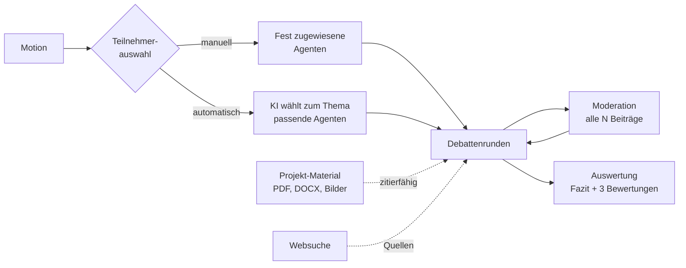

# Abelard

Multi-Agenten-Debattenplattform mit GraphRAG-Gedächtnis, KI-gestützter Moderation
und begründeter Abschlussauswertung. Läuft vollständig gegen selbst gehostete
LLM-Endpunkte — eine Cloud-Anbindung ist möglich, aber nicht erforderlich.

## Was das System tut

Mehrere LLM-Agenten mit ausgearbeiteten Personas diskutieren eine Fragestellung
(die *Motion*) über mehrere Runden. Ein Moderator greift in festen Intervallen ein,
erkennt Abschweifen und Themenverengung und steuert gegen. Am Ende entsteht keine
bloße Zusammenfassung, sondern eine **Bewertung der Debatte selbst**: Wie
erschöpfend wurde das Thema behandelt, wie plausibel ist das Ergebnis, wie sauber
wurden Quellen genutzt.



## Kernfunktionen

- **Personas mit Substanz** — 50 Wissenschaftler:innen aus neun Disziplinen plus
  sieben bekannte fiktive KIs, jeweils mit Biografie, Werkliste und
  charakteristischem Argumentationsstil
- **Automatische Teilnehmerauswahl** — die KI stellt anhand der Motion das fachlich
  passendste Feld zusammen und achtet dabei gezielt auf gegensätzliche Positionen
- **Projekt-Material** — Dokumente und Bilder hochladen; die Agenten zitieren
  während der Debatte daraus
- **Echte Recherche** — Websuche über SearXNG oder DuckDuckGo statt halluzinierter Quellen
- **Wirksame Moderation** — Korrekturen fließen in den Kontext der Agenten zurück,
  nicht nur in den Ausgabestrom
- **Mandantentrennung** — jeder Nutzer sieht nur eigene Daten; Admins geben Agenten
  global frei
- **Guardrails** — Kosten-, Runden- und Zeitlimit sowie Kill-Switch pro Session

## Schnellstart

```bash
cp .env.example .env
# POSTGRES_PASSWORD, NEO4J_PASSWORD und JWT_SECRET setzen:
#   openssl rand -hex 32

docker compose up -d --build
curl http://localhost:8106/health
```

Dashboard: `http://localhost:8106/`

## Wo weiterlesen

| Sie wollen … | Seite |
|---------------|-------|
| verstehen, wie die Teile zusammenhängen | [Architektur-Überblick](architecture/overview.md) |
| wissen, was während einer Debatte passiert | [Debatten-Lebenszyklus](architecture/debate-lifecycle.md) |
| das Datenmodell nachvollziehen | [Datenmodell](architecture/data-models.md) |
| die Engine konfigurieren | [Konfiguration](konfiguration.md) |
| Abhängigkeiten prüfen | [Abhängigkeiten](abhaengigkeiten.md) |
| Personas und Bewertungen verstehen | [Personas & Auswertung](personas-und-auswertung.md) |
| die API ansprechen | [API-Referenz](api-reference.md) |
| das Projekt veröffentlichen | [Veröffentlichung](veroeffentlichung.md) |

## Technischer Rahmen

Python 3.12, FastAPI, SQLAlchemy (async), PostgreSQL, Neo4j, ChromaDB, Valkey,
SearXNG. Alles in Docker Compose, mit Healthchecks und definierter Startreihenfolge.
