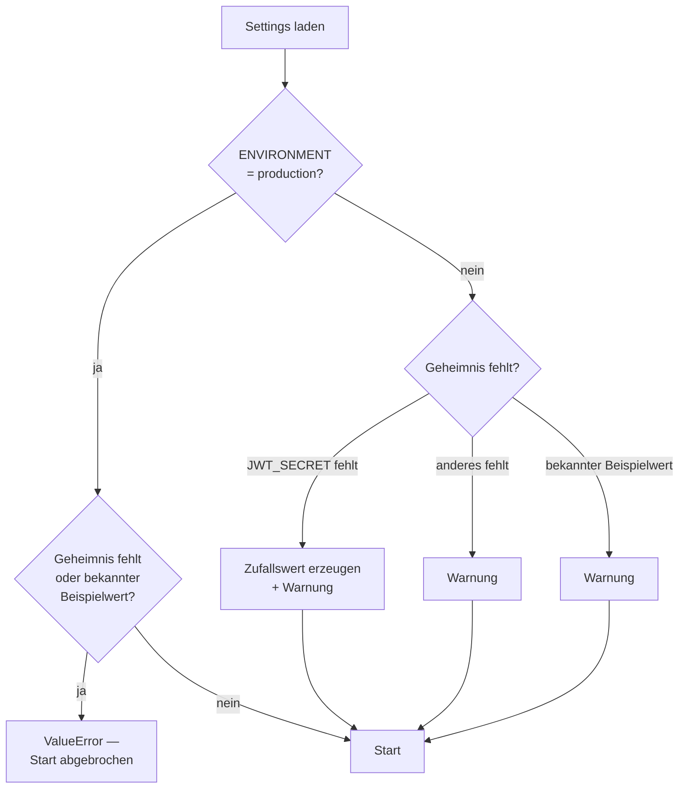
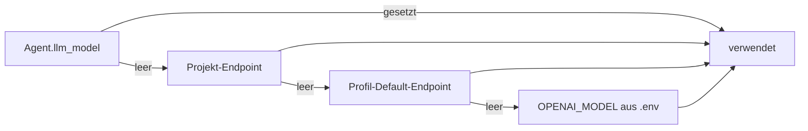

# Konfiguration

Die gesamte Konfiguration läuft über Umgebungsvariablen, gelesen von
`config.py` (Pydantic Settings). **Es gibt bewusst keine Credential-Defaults im
Quelltext.**

```bash
cp .env.example .env
openssl rand -hex 32   # für jedes Geheimnis einmal ausführen
```

## Wie Geheimnisse geprüft werden



Der erzeugte JWT-Schlüssel gilt nur bis zum Prozessende — alle Sitzungen werden
beim Neustart ungültig. Für dauerhaften Betrieb `JWT_SECRET` setzen.

## Betrieb

| Variable | Default | Zweck |
|----------|---------|-------|
| `ENVIRONMENT` | `development` | `production` erzwingt gesetzte, starke Geheimnisse |
| `API_HOST` | `0.0.0.0` | Bind-Adresse. Im Container korrekt; ohne Container besser `127.0.0.1` |
| `API_PORT` | `8000` | Port innerhalb des Containers |

## LLM-Anbindung

| Variable | Default | Zweck |
|----------|---------|-------|
| `DEFAULT_PROVIDER` | `openai` | `openai` spricht **jede** OpenAI-kompatible API, auch lokale Gateways |
| `OPENAI_API_KEY` | – | Schlüssel für den Standardanbieter |
| `OPENAI_MODEL` | `gpt-4o-mini` | Modell, wenn ein Agent keins gesetzt hat |
| `OLLAMA_BASE_URL` | `http://ollama:11430` | Nur bei `DEFAULT_PROVIDER=ollama` |
| `OLLAMA_MODEL` | `mistral:latest` | Modell für den Ollama-Pfad |
| `OLLAMA_KEEP_ALIVE` | `-1` | `-1` hält das Modell im VRAM und vermeidet Kaltstarts |

Diese Werte sind nur Rückfallebene. Pro Nutzer gespeicherte Endpunkte
(`user_llm_endpoints`) und pro Agent gesetzte Modelle haben Vorrang:



Dasselbe gilt für die Basis-URL: Ein leeres `Agent.llm_base_url` bedeutet
„erbt vom Endpoint des Nutzers" — das ist der Normalfall.

!!! tip "Reasoning-Modelle brauchen Token-Luft"
    Modelle wie `qwen3.6` oder `deepseek-r1` schreiben ihre Gedankenkette in ein
    separates Feld und lassen `content` leer, bis sie fertig gedacht haben. Bei zu
    kleinem `max_tokens` kommt eine leere Antwort zurück. Die Engine setzt deshalb
    2048 Tokens für den Moderator und 8192 für die Auswertung; `llm_client._extract_text()`
    fällt zusätzlich auf das `reasoning`-Feld zurück.

## Datenbanken

| Variable | Default | Zweck |
|----------|---------|-------|
| `POSTGRES_HOST` / `POSTGRES_PORT` | `postgres` / `5432` | Verbindung |
| `POSTGRES_USER` / `POSTGRES_DB` | `debate` / `sovereign_debate` | Zugang |
| `POSTGRES_PASSWORD` | – | **Pflicht** |
| `POSTGRES_URI` | – | Vollständige URI; überschreibt alle Einzelwerte |
| `NEO4J_URI` | `bolt://neo4j:7687` | Diskursgraph |
| `NEO4J_USER` / `NEO4J_PASSWORD` | `neo4j` / – | **Passwort Pflicht** |
| `VALKEY_HOST` / `VALKEY_PORT` | `valkey` / `6379` | Zähler und Kill-Switch |
| `VALKEY_PASSWORD` | leer | Leer = ohne Auth, nur im internen Netz vertretbar |
| `CHROMA_PERSIST_DIR` | `/chroma-data` | Vektorindex auf der Platte |

## Recherche und Dateien

| Variable | Default | Zweck |
|----------|---------|-------|
| `SEARXNG_BASE_URL` | `http://searxng:8080` | Websuche der Agenten |
| `UPLOAD_DIR` | `/data/uploads` | Hochgeladenes Material |
| `UPLOAD_MAX_BYTES` | `20971520` (20 MB) | Obergrenze je Datei |
| `DEBATE_LOG_DIR` | `/data/debate-logs` | JSONL-Verlauf je Session |

Liefert SearXNG keine Treffer, fällt die Suche automatisch auf DuckDuckGo zurück.

## Authentifizierung

| Variable | Default | Zweck |
|----------|---------|-------|
| `JWT_SECRET` | – | **Pflicht**, sonst Zufallswert je Start |
| `JWT_ALGORITHM` | `HS256` | Signaturverfahren |
| `JWT_EXPIRE_MINUTES` | `1440` | Token-Gültigkeit (24 Stunden) |

## Debattensteuerung

| Variable | Default | Zweck |
|----------|---------|-------|
| `MODERATOR_INTERVAL` | `3` | Beiträge zwischen zwei Moderator-Eingriffen |
| `COST_THRESHOLD_USD` | `5.0` | Kostenbremse — Debatte stoppt beim Überschreiten |
| `DEFAULT_TEMPERATURE` | `0.7` | Sampling, wenn ein Agent nichts eigenes setzt |

Runden- und Zeitlimit stehen pro Projekt in `moderator_config`, nicht in der `.env`.

## Deployment-spezifische Ergänzungen

Alles, was nur für **eine** Installation gilt, gehört in
`docker-compose.override.yml` — die Datei wird automatisch gemerged und ist von
der Veröffentlichung ausgenommen:

```yaml
services:
  app:
    extra_hosts:
      - "search.example.org:203.0.113.10"
```

Vorlage: `docker-compose.override.yml.example`.

## Konfiguration prüfen

```bash
docker compose exec app python -c "
from config import settings
print('Umgebung:', settings.environment)
print('Provider:', settings.default_provider)
print('SearXNG :', settings.searxng_base_url)
print('Logs    :', settings.debate_log_dir)
"
```

Warnungen zu schwachen Geheimnissen erscheinen beim Start im Log:

```bash
docker compose logs app | grep -i "Beispiel-Passwort\|JWT_SECRET"
```
