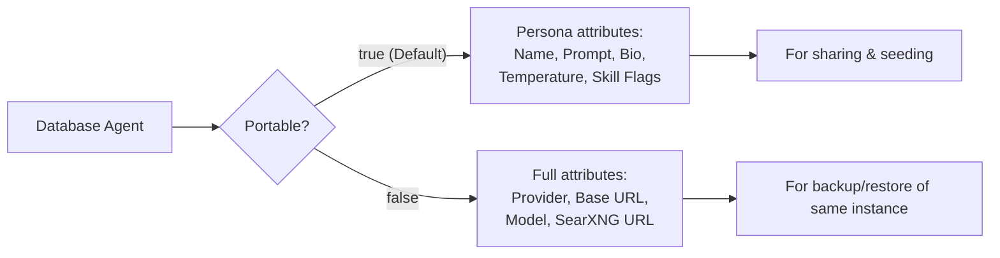

# Importing and Exporting Agents

Agents can be exported as versioned JSON files, shared, and restored onto fresh installations. A bundled collection of 60 default personas is included under `seeds/agents.json`.

## Two Export Modes



- **Portable (`portable=true`):** Exports core persona definitions only. Omits instance-specific endpoint URLs and models so imported agents inherit the importing user's default LLM endpoint.
- **Full (`portable=false`):** Retains exact provider, base URL, and model settings. Best used for backup/restore on the same instance.

!!! note "API keys are never exported"
    API credentials belong to `UserLLMEndpoint`, not the `Agent` model — keys are never included in exports.

Auto-generated project clones (`skills_json.auto_assigned: true`) are omitted from exports.

## API Endpoints

```
GET  /api/v2/agents/export?scope=own|global|all&portable=true|false
POST /api/v2/agents/import?on_conflict=skip|rename|replace&make_global=false
POST /api/v2/agents/import/seed?on_conflict=skip&make_global=false
```

| Conflict Policy | Action when duplicate name is encountered |
|-----------------|-------------------------------------------|
| `skip` (default) | Existing agent remains untouched |
| `rename` | Imported agent is saved as "Name (2)" |
| `replace` | Existing agent is deleted and replaced |

`make_global=true` is restricted to Administrators (returns 403 for non-admins).

## Bundled Seed Collection

`seeds/agents.json` contains 60 personas (the 57 library personas plus Socrates, Immanuel Kant, and Johann Wolfgang von Goethe).

The seed file is deterministic (alphabetically sorted, timestamp-free), ensuring git diffs are generated only when persona attributes actually change.
