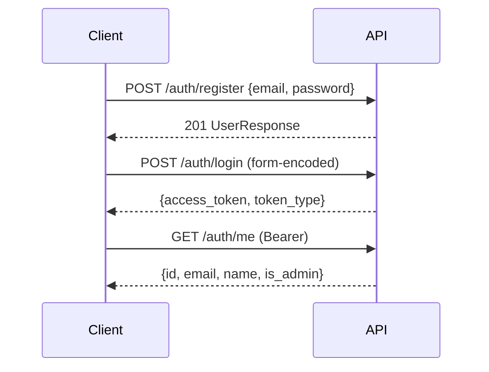

# API Reference

All REST endpoints are grouped under `/api/v2`. Except for registration and login, all requests require a JWT supplied in the header `Authorization: Bearer <token>` — or as a query parameter `?token=...` (required for WebSocket streams and file downloads).

Every query enforces strict multi-tenancy by filtering against `user_id`. Non-owned objects return **404 Not Found** rather than 403 Forbidden to prevent object enumeration.

## Authentication



| Method | Endpoint Path | Purpose |
|--------|---------------|---------|
| POST | `/auth/register` | User registration (password min 8 characters) |
| POST | `/auth/login` | Login, returns JWT (OAuth2 form-encoded) |
| GET | `/auth/me` | Inspect current user including `is_admin` status |

## LLM Endpoints (Profile Level)

Per-user stored credentials. The endpoint with `is_default: true` is the user's default LLM and is used for automatic agent selection.

| Method | Endpoint Path | Purpose |
|--------|---------------|---------|
| POST | `/llm-endpoints` | Add LLM endpoint |
| GET | `/llm-endpoints` | List user's LLM endpoints |
| GET | `/llm-endpoints/{id}` | Get specific endpoint details |
| PATCH | `/llm-endpoints/{id}` | Update endpoint settings |
| DELETE | `/llm-endpoints/{id}` | Delete endpoint |
| POST | `/llm-endpoints/{id}/set-default` | Set as default profile LLM |
| POST | `/llm-endpoints/test` | Test unsaved credentials connection |
| POST | `/llm-endpoints/{id}/test` | Test saved endpoint connectivity |
| GET | `/llm-endpoints/models` | List models available on default endpoint |
| GET | `/llm-endpoints/{id}/models` | List models available on specific endpoint |

## Agent Management

| Method | Endpoint Path | Purpose |
|--------|---------------|---------|
| POST | `/agents` | Create custom agent |
| GET | `/agents?scope=all\|own\|global` | List agents; `all` returns owned plus global agents |
| GET | `/agents/{id}` | Retrieve owned or global agent details |
| PUT | `/agents/{id}` | Update agent (owner only) |
| DELETE | `/agents/{id}` | Delete agent (owner only) |
| PATCH | `/agents/{id}/global` | Toggle global sharing (**Admins only**) |
| POST | `/agents/{id}/clone` | Clone global agent into user scope |
| POST | `/agents/seed-personas?make_global=true` | Seed 57 persona templates (idempotent) |

## Project Management

| Method | Endpoint Path | Purpose |
|--------|---------------|---------|
| POST | `/projects` | Create project with motion and moderator config |
| GET | `/projects` | List user projects |
| GET | `/projects/{id}` | Retrieve project details |
| PATCH | `/projects/{id}` | Update project |
| DELETE | `/projects/{id}` | Delete project (cascades to agents, sessions, uploads) |
| POST | `/projects/{id}/suggest-agents` | AI-assisted participant suggestion |

## Project Materials (Document Uploads)

| Method | Endpoint Path | Purpose |
|--------|---------------|---------|
| POST | `/projects/{id}/documents` | Upload file (`file`, `description` form parameters) |
| GET | `/projects/{id}/documents` | List uploaded project materials |
| GET | `/projects/{id}/documents/{doc_id}/download` | Download original file |
| DELETE | `/projects/{id}/documents/{doc_id}` | Delete file and remove vector index chunks |

Supported file types: `.txt`, `.md`, `.pdf`, `.docx`, `.png`, `.jpg`, `.jpeg`, `.webp`, `.gif`.

## Debate Execution & Lifecycle

| Method | Endpoint Path | Purpose |
|--------|---------------|---------|
| POST | `/debates` | Create debate session |
| GET | `/debates` | List user debate sessions |
| GET | `/debates/{id}` | Retrieve debate status |
| POST | `/debates/{id}/start` | Launch debate execution |
| POST | `/debates/{id}/stop` | Trigger kill switch and terminate task |
| DELETE | `/debates/{id}` | Delete debate session |
| GET | `/debates/{id}/turns` | Get all session events (`turn`, `moderator`, `synthesis`) |
| GET | `/debates/{id}/evaluation` | Fetch final evaluation report |
| POST | `/debates/{id}/evaluate` | Regenerate final evaluation |
| GET | `/debates/{id}/export` | Export debate transcript |
| WS | `/debates/{id}/stream` | Live WebSocket event stream |

### Live Stream WebSocket

```javascript
const ws = new WebSocket(`ws://localhost:8106/api/v2/debates/${id}/stream?token=${jwt}`);
ws.onmessage = (e) => {
  const { type, data } = JSON.parse(e.data);   // type: "turn"
  console.log(data);   // "[CHARLES BENNETT]: ..."
};
```

## System & Diagnostics Endpoints

| Method | Endpoint Path | Purpose |
|--------|---------------|---------|
| GET | `/health` | Application health check (no auth required) |
| GET | `/` | User Dashboard UI |
| GET | `/docs` | Interactive Swagger / OpenAPI documentation |

## Error Codes

| Status Code | Description |
|-------------|-------------|
| 400 Bad Request | Invalid parameter or malformed request payload |
| 401 Unauthorized | Missing, invalid, or expired JWT token |
| 403 Forbidden | Action reserved for Administrators |
| 404 Not Found | Resource does not exist **or** is not owned by current tenant |
| 409 Conflict | Name collision during cloning operations |
| 410 Gone | Referenced file recorded in DB but missing from disk |
| 422 Unprocessable | Validation error (unsupported file format or file size exceeded) |
| 502 Bad Gateway | Upstream service failure (LLM call or evaluation error) |
