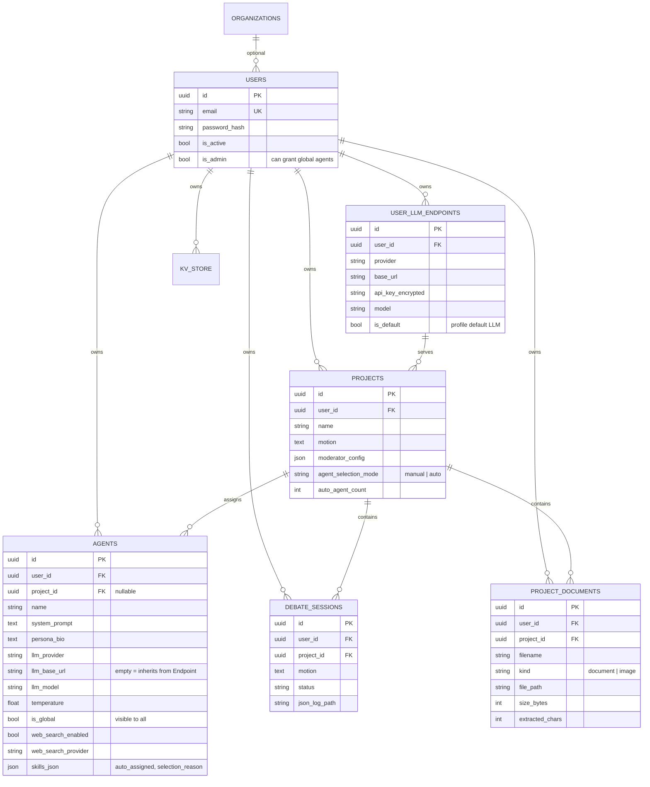
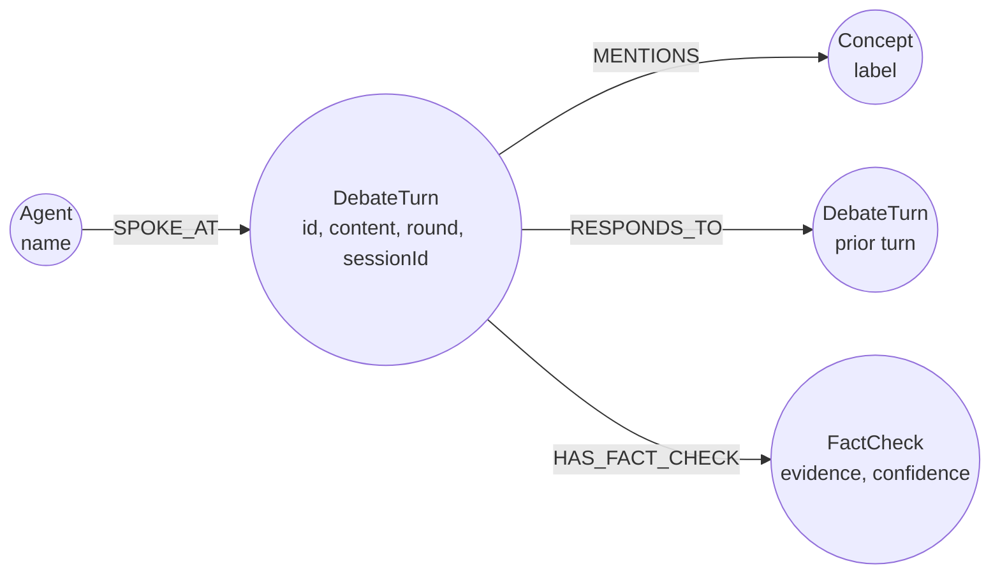

# Data Models

## Relational Model (PostgreSQL)



### Multi-Tenancy Enforcement

Every table except `organizations` includes a **mandatory** `user_id` column. All queries filter strictly by user ownership. The sole exception: agents with `is_global = true` are **visible** to all users, but remain owned by their creator and cannot be modified or deleted by other users.

!!! warning "project_id is a single reference column"
    An agent belongs to at most one project. If an external user were to directly assign a global agent to their project, it would transfer ownership out of the creator's account. Therefore, `_assign_agents_to_project()` clones global agents belonging to other users into the target project instead of moving them.

### Schema Migration Strategy

Alembic is omitted by design. `DBManager.initialize()` creates missing tables via `create_all` and appends new columns idempotently:

```sql
ALTER TABLE agents   ADD COLUMN IF NOT EXISTS is_global BOOLEAN DEFAULT FALSE;
ALTER TABLE users    ADD COLUMN IF NOT EXISTS is_admin  BOOLEAN DEFAULT FALSE;
ALTER TABLE projects ADD COLUMN IF NOT EXISTS agent_selection_mode VARCHAR(16) DEFAULT 'manual';
```

This handles additive changes cleanly. Column renames or type modifications require manual migration steps.

## Discourse Graph (Neo4j)



Every `DebateTurn` node stores a `sessionId` property — without it, graph queries would aggregate turns across **all historical debate sessions**, corrupting loop detection.

**Concept Extraction:** Words with 5+ characters starting with a capital letter, excluding stopwords (max 20 per turn).

## Vector Index (ChromaDB)

Two distinct collections serve complementary functions:

| Collection | Content | Metadata | Filtered By |
|------------|---------|----------|-------------|
| `debate_turns` | Speech contributions | `session_id`, `agent_name`, `round_num` | `session_id` |
| `project_documents` | Material chunks | `project_id`, `doc_id`, `filename`, `kind` | `project_id` |

Documents are parsed into ~1,200-character chunks with 200-character overlaps, split along paragraph or sentence boundaries.

## Runtime State (Valkey)

All keys are strictly isolated per debate session:

| Key | Purpose |
|-----|---------|
| `debate:{session_id}:status:active` | Session kill switch |
| `debate:{session_id}:cost:central` | Cumulative cost counter in USD |
| `debate:{session_id}:tokens:central` | Cumulative token usage |
| `debate:{session_id}:counter:turn` | Turn counter for moderation intervals |
| `debate:killswitch:global` | Global emergency shutdown switch |

## File Storage Layout

```
{UPLOAD_DIR}/{project_id}/{doc_id}_{filename}     Uploaded materials
{DEBATE_LOG_DIR}/{session_id}/turns.jsonl          Turns, moderation, evaluation
```
