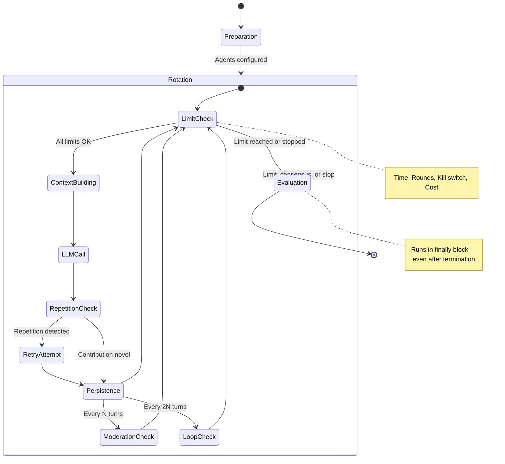
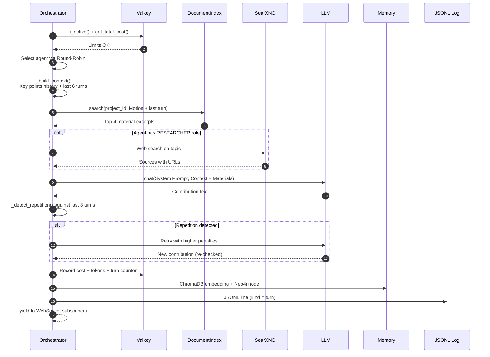
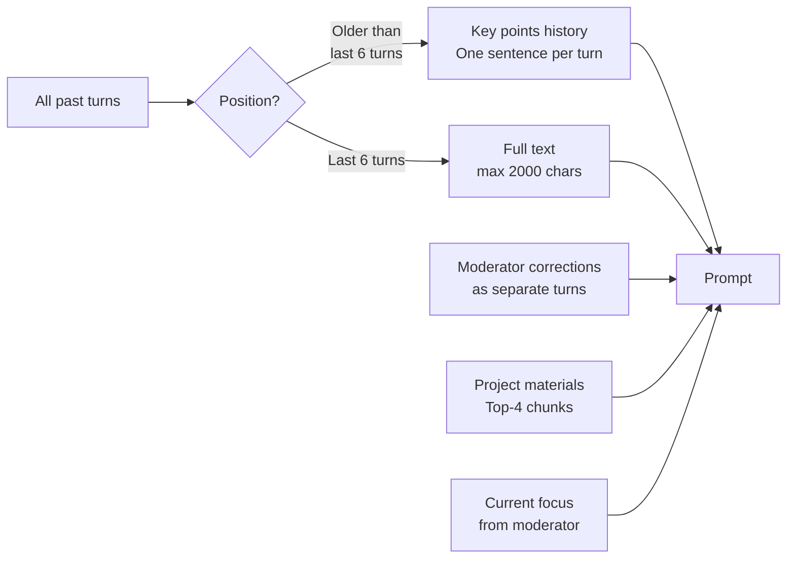
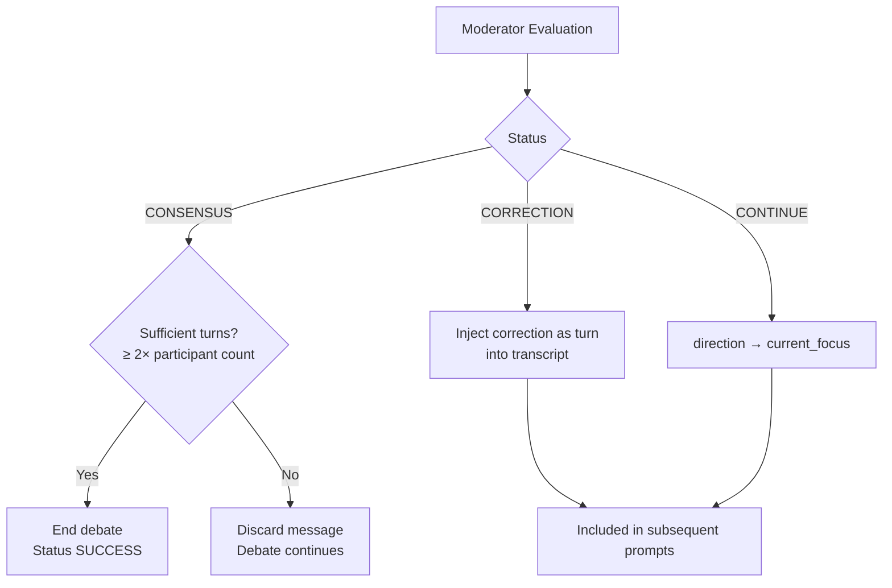
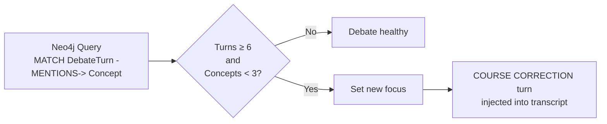
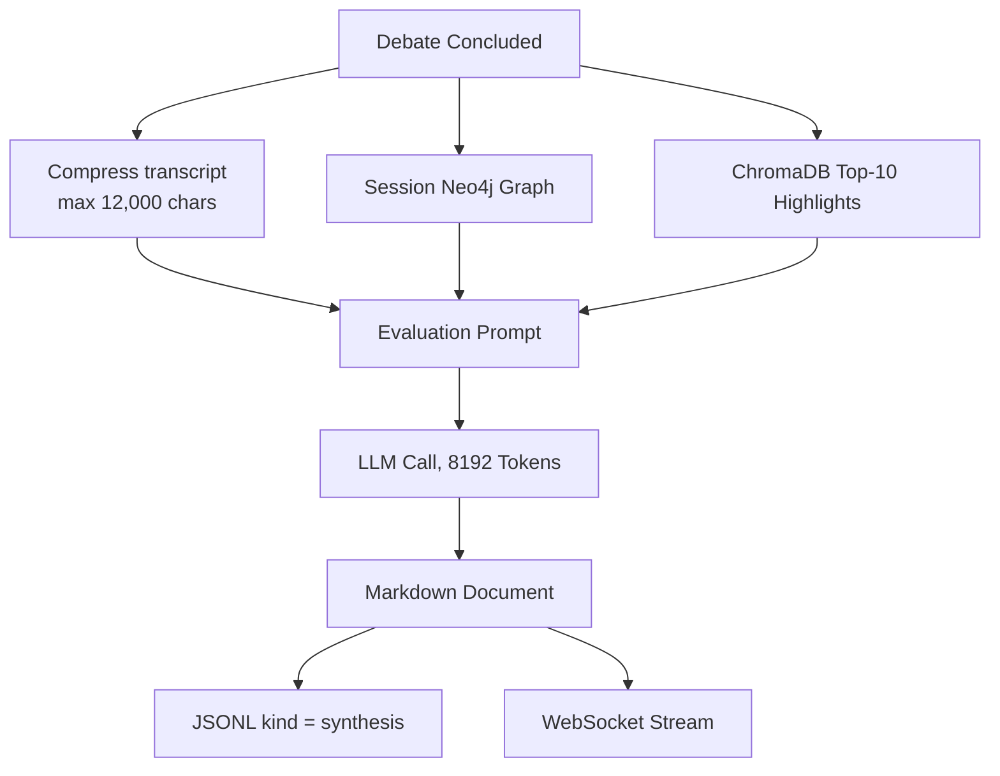

# Debate Lifecycle

A debate progresses through three distinct phases: Preparation, Rotation, and Evaluation. The entire lifecycle is encapsulated in `engine/orchestrator.py::run_debate()`.

## Overall Execution Flow

## Single Turn in Detail

## Context Construction — Anti-Loop Mechanism

Earlier versions passed only the last two turns to agents. When more than two agents participated, an agent could not even observe its own previous statement — inevitably leading to repetition.

Crucially, **moderator corrections are injected as separate turns** into `state.turns`. Previously, corrections were only streamed over WebSockets without reaching the agents — rendering moderation ineffective.

## Moderation

The moderator runs every `interval_turns` contributions and observes the **entire** debate transcript (older turns condensed, last three in full text).

The consensus lock prevents a single agreeable contribution from ending the debate prematurely.

## Loop Detection

Every `2 × interval_turns` contributions, the orchestrator queries the discourse graph in Neo4j to measure how many **distinct** concepts were mentioned in the session:

The minimum threshold of six turns is essential: without it, young debates would trigger loop detection before concepts have had time to accumulate.

## Termination Conditions

| Condition | Verification | Result |
|-----------|--------------|--------|
| Time Limit | `max_duration_minutes` | `TERMINATED` |
| Round Limit | `max_rounds` (1 round = each agent once) | `TERMINATED` |
| Kill Switch | Valkey `debate:{id}:status:active` | `TERMINATED` |
| Cost Guardrail | Valkey total cost ≥ `COST_THRESHOLD_USD` | `TERMINATED` |
| Consensus | Moderator reports `CONSENSUS` | `SUCCESS` |

In **all** cases, the final evaluation runs afterwards as it is placed in the `finally` execution block.

## Final Evaluation

The output contains a summary, key arguments, conclusion, three analytical ratings (exhaustion degree, plausibility, source quality — each 1–10 with detailed rationale), and open questions.

## Event Persistence

All events are persisted in `{DEBATE_LOG_DIR}/{session_id}/turns.jsonl`:

| `kind` | Description |
|--------|-------------|
| `turn` | Agent speech contribution |
| `moderator` | Moderator evaluation, correction, or course shift |
| `synthesis` | Final evaluation report |
