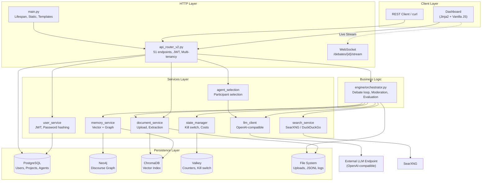
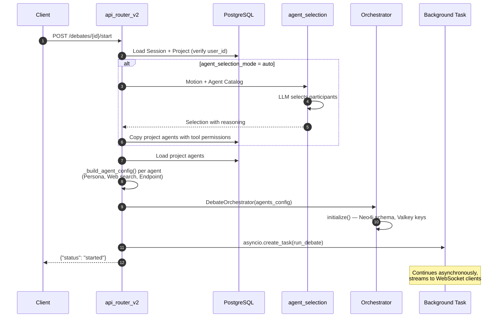

# Architecture Overview

The engine is divided into four distinct layers. The core architectural rule: **`main.py` contains no business logic**, `engine/` is unaware of HTTP details, and `services/` contains neither HTTP logic nor debate lifecycle workflows.



## Layer Responsibilities and Constraints

| Layer | Directory | Allowed To | Forbidden From |
|-------|-----------|------------|----------------|
| HTTP | `main.py`, `api_router_v2.py` | Validate requests, check tenancy, call engine | Containing business logic |
| Business Logic | `engine/` | Control debate flow, orchestrate services | Handling HTTP objects |
| Services | `services/` | Encapsulate external systems | Handling debate lifecycle |
| Models | `models/` | Define data schemas | Containing business logic |

## Why Three Data Stores?

The three memory stores answer distinct structural questions and are non-redundant:

- **PostgreSQL** — *Who owns what?* Users, projects, agents, sessions. Relational integrity and strict multi-tenancy enforcement.
- **ChromaDB** — *What is semantically similar?* Vector search across debate contributions and uploaded materials. Serves matching material excerpts to the orchestrator per turn.
- **Neo4j** — *Who referenced what?* The discourse graph connecting agents, contributions, and concepts. Serves as the foundation for loop detection: if concept density narrows, the debate is repeating itself.

**Valkey** is operational state management, not memory: kill switch, cost counters, and turn tracking. All keys are isolated per session (`debate:{session_id}:...`) to ensure parallel debates do not interfere with each other.

## Data Flow at Debate Launch



!!! warning "The background task lives inside the app process"
    `run_debate()` runs as an `asyncio` task inside uvicorn. **Restarting the app container terminates active debates.** Verify whether debates are active before deployments and bundle changes rather than restarting frequently.

## Directory Structure

```
├── main.py                      HTTP entrypoint, Lifespan
├── api_router_v2.py             REST + WebSocket, Multi-tenancy
├── config.py                    Pydantic Settings — single source of configuration
├── engine/
│   └── orchestrator.py          Debate loop, moderation, evaluation
├── services/
│   ├── llm_client.py            OpenAI-compatible calls, reasoning fallback
│   ├── agent_selection_service.py  AI-assisted participant selection
│   ├── persona_library.py       57 pre-configured personas
│   ├── memory_service.py        ChromaDB + Neo4j, isolated per session
│   ├── document_service.py      Upload, text extraction, chunking
│   ├── search_service.py        SearXNG with DuckDuckGo fallback
│   ├── state_manager.py         Valkey: Kill switch, cost, counters
│   ├── user_service.py          JWT and password hashing (stdlib)
│   └── templates/               Dashboard templates
├── models/db.py                 SQLAlchemy ORM models
├── scripts/                     Sync and security scripts
└── tests/                       114 unit & integration tests
```
