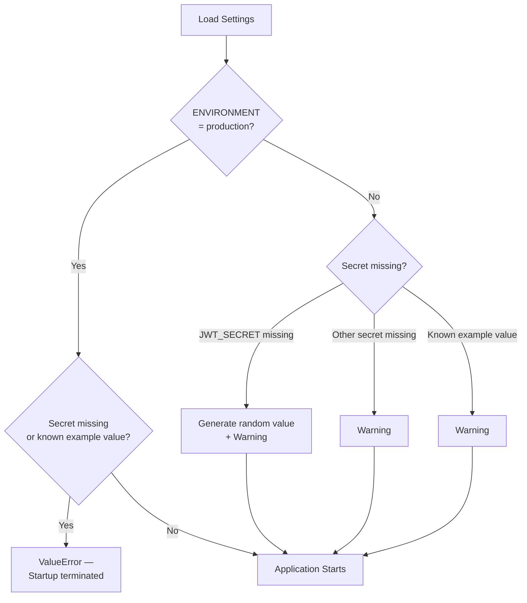
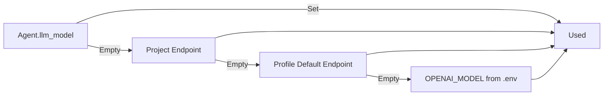

# Configuration

All configuration settings are managed via environment variables, loaded by `config.py` (Pydantic Settings). **No credential defaults are hardcoded in source files.**

```bash
cp .env.example .env
openssl rand -hex 32   # Run once per required secret
```

## How Secrets are Validated



Generated JWT keys persist only for the duration of the application process — all active sessions become invalid upon container restart. Set `JWT_SECRET` in `.env` for production setups.

## General Operational Settings

| Variable | Default | Purpose |
|----------|---------|---------|
| `ENVIRONMENT` | `development` | Setting to `production` enforces strong secrets |
| `API_HOST` | `0.0.0.0` | Container bind address |
| `API_PORT` | `8000` | Internal container port |

## LLM Gateway Settings

| Variable | Default | Purpose |
|----------|---------|---------|
| `DEFAULT_PROVIDER` | `openai` | Supports any OpenAI-compatible API endpoint |
| `OPENAI_API_KEY` | – | API key for standard provider |
| `OPENAI_MODEL` | `gpt-4o-mini` | Fallback model when an agent specifies none |
| `OLLAMA_BASE_URL` | `http://ollama:11430` | Applicable when `DEFAULT_PROVIDER=ollama` |
| `OLLAMA_MODEL` | `mistral:latest` | Model choice for local Ollama fallback |
| `OLLAMA_KEEP_ALIVE` | `-1` | Keeps model loaded in VRAM to prevent cold starts |

User-configured endpoints (`user_llm_endpoints`) and agent-specific models override global defaults:



!!! tip "Reasoning models require token headroom"
    Reasoning models like `deepseek-r1` output their chain of thought separately and keep `content` empty until thinking completes. Setting a small `max_tokens` limit results in empty string responses. The engine sets 2,048 max tokens for moderation calls and 8,192 for final evaluations; `llm_client._extract_text()` falls back to checking the `reasoning` field.

## Database Connection Settings

| Variable | Default | Purpose |
|----------|---------|---------|
| `POSTGRES_HOST` / `POSTGRES_PORT` | `postgres` / `5432` | Database network location |
| `POSTGRES_USER` / `POSTGRES_DB` | `debate` / `sovereign_debate` | Credentials and DB name |
| `POSTGRES_PASSWORD` | – | **Required** |
| `POSTGRES_URI` | – | Full connection URI (overrides individual params) |
| `NEO4J_URI` | `bolt://neo4j:7687` | Discourse graph address |
| `NEO4J_USER` / `NEO4J_PASSWORD` | `neo4j` / – | **Password required** |
| `VALKEY_HOST` / `VALKEY_PORT` | `valkey` / `6379` | Runtime counters & kill switch |
| `VALKEY_PASSWORD` | empty | Empty = unauthenticated |
| `CHROMA_PERSIST_DIR` | `/chroma-data` | On-disk vector index path |

## Research and Storage Settings

| Variable | Default | Purpose |
|----------|---------|---------|
| `SEARXNG_BASE_URL` | `http://searxng:8080` | Web search endpoint |
| `UPLOAD_DIR` | `/data/uploads` | Material upload storage |
| `UPLOAD_MAX_BYTES` | `20971520` (20 MB) | File size limit |
| `DEBATE_LOG_DIR` | `/data/debate-logs` | Session JSONL log directory |

## Authentication Settings

| Variable | Default | Purpose |
|----------|---------|---------|
| `JWT_SECRET` | – | **Required** (generated if omitted in dev) |
| `JWT_ALGORITHM` | `HS256` | Signature algorithm |
| `JWT_EXPIRE_MINUTES` | `1440` | Token expiration window (24 hours) |

## Debate Execution Settings

| Variable | Default | Purpose |
|----------|---------|---------|
| `MODERATOR_INTERVAL` | `3` | Turns between moderator interventions |
| `COST_THRESHOLD_USD` | `5.0` | Cost limit per debate session |
| `DEFAULT_TEMPERATURE` | `0.7` | Default sampling temperature |
