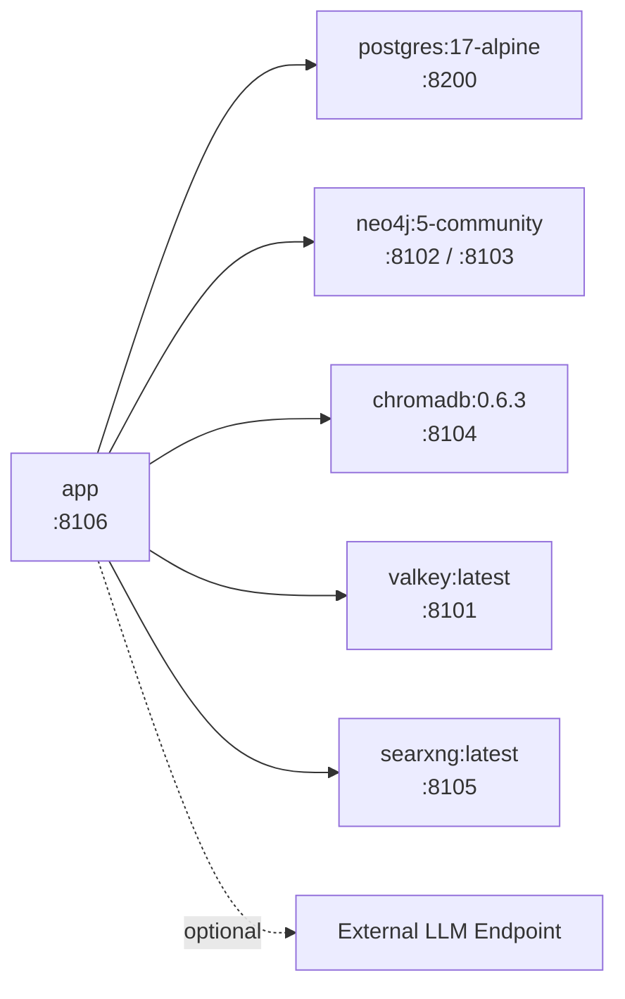

# Dependencies

Python 3.12 or newer. Dependency declarations are kept synchronized across two main files: `requirements.txt` (runtime) and `requirements-dev.txt` (testing and static analysis tools). `pyproject.toml` mirrors these dependencies for Poetry users.

```bash
pip install -r requirements.txt        # Production runtime
pip install -r requirements-dev.txt    # Development setup
poetry install                         # Alternative setup
```

## Runtime Dependencies

### Web Framework and Server

| Package | Version | Purpose |
|---------|---------|---------|
| `fastapi` | 0.115.6 | REST and WebSocket API endpoints, Pydantic data validation |
| `uvicorn[standard]` | 0.34.0 | ASGI web server |
| `jinja2` | 3.1.5 | Renders dashboard HTML templates |
| `python-multipart` | 0.0.20 | Handles `multipart/form-data` during file uploads |

!!! warning "FastAPI version is pinned"
    With FastAPI 0.141 and Starlette 1.3, `include_router()` fails to register routes properly — the application starts but returns 404 for all endpoints. Pinning to version 0.115.6 is intentional.

### Database Drivers

| Package | Version | Purpose |
|---------|---------|---------|
| `sqlalchemy[asyncio]` | 2.0.36 | ORM with asynchronous sessions |
| `asyncpg` | 0.30.0 | High-performance PostgreSQL driver for async execution |

### Memory Stores

| Package | Version | Purpose |
|---------|---------|---------|
| `neo4j` | 5.27.0 | Discourse graph async driver |
| `chromadb` | 0.6.3 | Vector index for turns and document chunks |
| `redis[hiredis]` | 5.2.1 | Valkey client — `redis.asyncio` submodule |

### HTTP Client

| Package | Version | Purpose |
|---------|---------|---------|
| `httpx` | 0.28.1 | Asynchronous HTTP client for LLM API calls, web searches, and tests |

The official `openai` SDK is **not** used. All API calls target the OpenAI-compatible HTTP interface directly using `httpx`, eliminating extra SDK dependencies and supporting custom LLM gateways out of the box.

### Configuration Management

| Package | Version | Purpose |
|---------|---------|---------|
| `pydantic` | 2.10.4 | Data models and field validation |
| `pydantic-settings` | 2.7.1 | Parses environment variables and `.env` files |
| `python-dotenv` | 1.0.1 | File parsing for `.env` |

### Document Parsing

| Package | Version | Purpose |
|---------|---------|---------|
| `pypdf` | 6.10.2 | PDF text extraction |
| `python-docx` | 1.2.0 | DOCX paragraph and table extraction |
| `pillow` | 12.2.0 | Image metadata processing |

## Development Dependencies

| Package | Purpose |
|---------|---------|
| `pytest`, `pytest-asyncio`, `pytest-cov` | Test suite execution (114 unit/integration tests) |
| `ruff` | Fast Python linter and import sorter |
| `mypy` | Static type checking |
| `bandit` | Security vulnerability analysis executed via `scripts/run_security_scan.sh` |
| `mkdocs`, `mkdocs-material` | Material documentation builder with Mermaid support |

## Deliberately Omitted Packages

| Package | Omission Reason |
|---------|-----------------|
| `openai` | API calls execute directly via `httpx` against compatible endpoints |
| `python-jose` | JWT signatures are computed using `hmac` and `hashlib` |
| `passlib` / `bcrypt` | Password hashing uses standard library `hashlib` |
| `alembic` | Database schema migrations use additive `create_all` and `ALTER TABLE ... IF NOT EXISTS` |
| `psycopg2-binary` | Async database access uses `asyncpg` exclusively |

## External Containerized Services

Managed via `docker-compose.yml`:



| Service | Image | Host Port |
|---------|-------|-----------|
| PostgreSQL | `postgres:17-alpine` | 8200 |
| Neo4j | `neo4j:5-community` (with APOC) | 8102 (HTTP), 8103 (Bolt) |
| ChromaDB | `chromadb/chroma:0.6.3` | 8104 |
| Valkey | `valkey/valkey:latest` | 8101 |
| SearXNG | `searxng/searxng:latest` | 8105 |
| Application | Local build | 8106 |

All services include health checks; the app container delays startup until all services report healthy status.

LLM provider endpoints are **not** bundled in docker-compose — users specify their preferred provider endpoints in their user profile settings.
