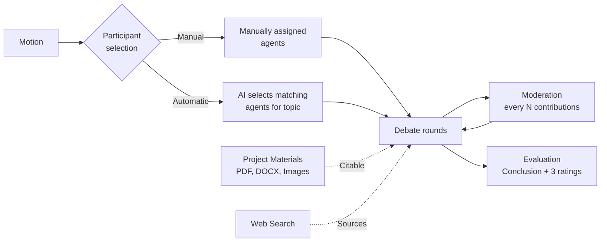

# Abelard

Multi-agent debate platform featuring GraphRAG memory, AI-powered moderation,
and reasoned final evaluations. Runs fully self-hosted against local
LLM endpoints — cloud connectivity is supported, but not required.

## What the System Does

Multiple LLM agents with elaborate personas discuss a topic or motion (*the Motion*) over several rounds. A moderator intervenes at fixed intervals, detecting tangents or topic narrowness and applying corrective steering. At the end, the system produces more than a simple summary — it generates a **comprehensive evaluation of the debate itself**: how exhaustively the topic was covered, how plausible the result is, and how rigorously sources were used.



## Core Features

- **Personas with Depth** — 50 scientists across nine disciplines plus seven famous fictional AIs, each with biography, key publications, and a distinct argumentation style.
- **Automated Participant Selection** — AI curates the most suitable panel based on the motion, deliberately fostering opposing viewpoints.
- **Project Materials** — Upload documents and images; agents retrieve and cite relevant excerpts during the debate.
- **Real Research** — Web search via SearXNG or DuckDuckGo instead of hallucinated references.
- **Effective Moderation** — Corrections are fed directly back into agent context, not just the output stream.
- **Multi-Tenancy** — Strict user data isolation; admins can share agents globally.
- **Guardrails** — Cost, round, and time limits accompanied by a real-time kill switch per session.

## Quickstart

```bash
cp .env.example .env
# Set POSTGRES_PASSWORD, NEO4J_PASSWORD, and JWT_SECRET:
#   openssl rand -hex 32

docker compose up -d --build
curl http://localhost:8106/health
```

Dashboard: `http://localhost:8106/`

## Documentation Navigation

| I want to ... | Page |
|---------------|------|
| Understand how components fit together | [Architecture Overview](architecture/overview.md) |
| Know what happens during a debate | [Debate Lifecycle](architecture/debate-lifecycle.md) |
| Inspect the data structures | [Data Models](architecture/data-models.md) |
| Configure the engine | [Configuration](configuration.md) |
| Review system dependencies | [Dependencies](dependencies.md) |
| Learn about personas and ratings | [Personas & Evaluation](personas-and-evaluation.md) |
| Interact with the REST API | [API Reference](api-reference.md) |
| Publish the project | [Publishing](publishing.md) |

## Technical Framework

Python 3.12, FastAPI, SQLAlchemy (async), PostgreSQL, Neo4j, ChromaDB, Valkey, SearXNG. Entirely containerized with Docker Compose, health checks, and strict startup ordering.
